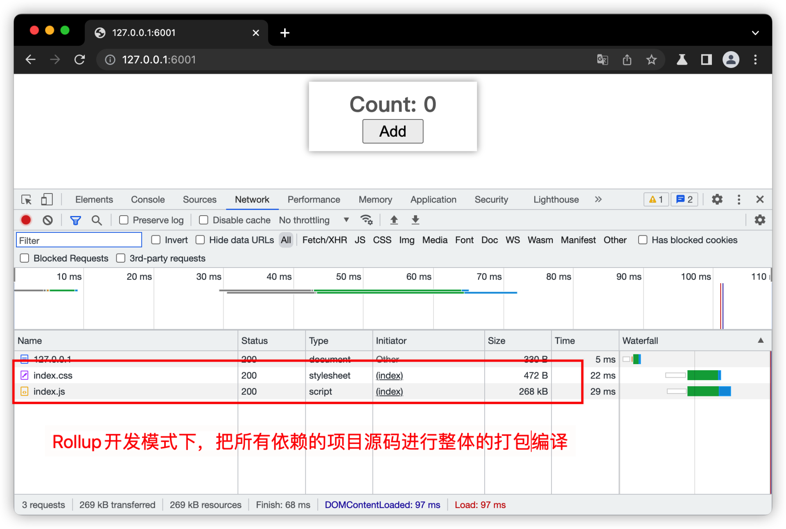
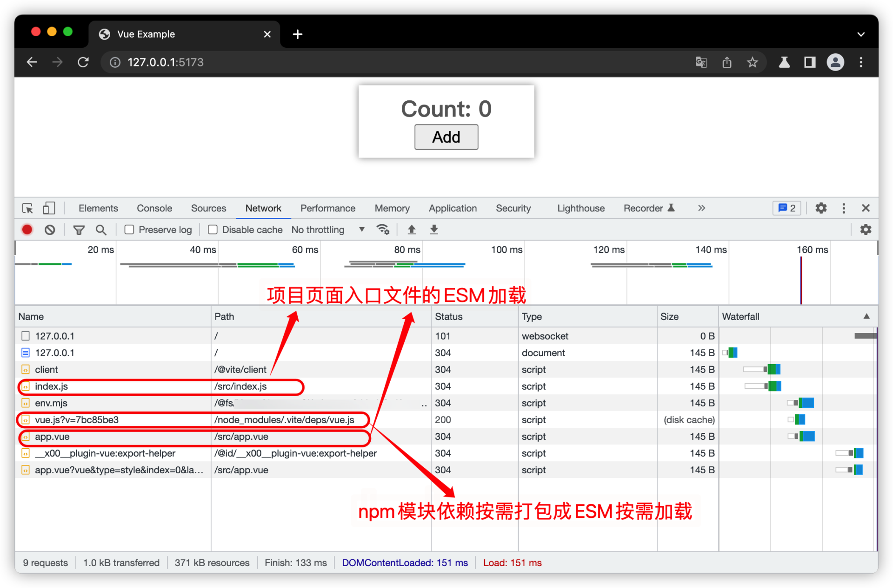
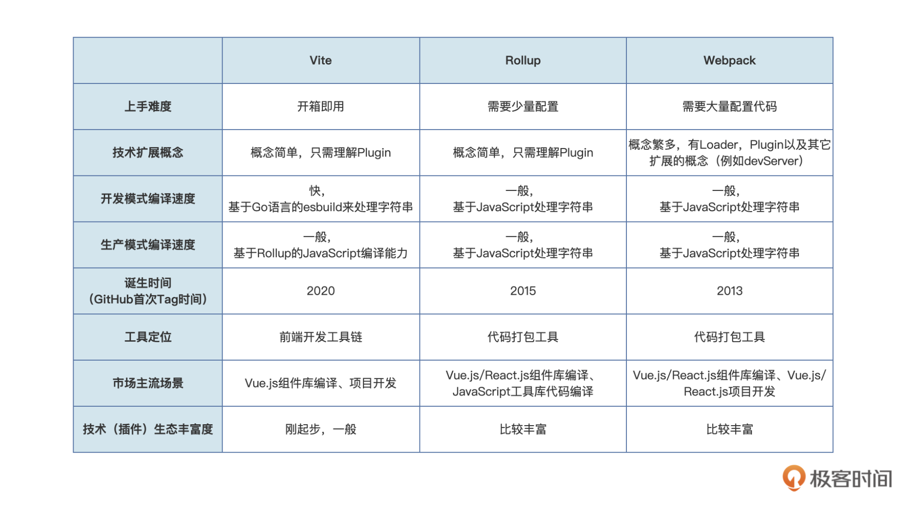

# 03｜从Rollup到Vite：如何用Vite构建你的Vue 3项目？
你好，我是杨文坚。

上节课我们跳过了官方推荐的Vite，选择了Webpack来搭建Vue.js 3项目，这是因为我们看重Webpack丰富的技术生态，Webpack发展了近10年，沉淀了许多问题处理经验，企业级的应用打包编译方案也相当丰富。

但是，近两年Vue.js官方推出了Vite，很多新项目也开始使用Vite。Vite作为Vue.js 3官方标配的开发工具，代表了官方技术的发展方向，因此作为后续Vue学习和进阶，肯定是不可跳过的一环。

所以这一讲，我们就来尝试一下，如何用Vite来搭建Vue.js 3项目。不过，在开始之前，我还是需要给你简单介绍一下Vite。

## Vite：Vue.js 3的官方标配

首先我们要知道，Vue.js发展到现在，已经不是一个纯粹的前端页面代码库或者框架了，而是一整套技术体系。这里的技术体系是指围绕着Vue.js进行构建的技术生态，包括测试工具Vitest、文档工具VitePress等等。这些工具开箱即用的能力，目前都是基于Vite来进行打造的，这也说明了Vite在整个Vue.js生态中的重要位置。

Vite是Vue.js作者尤雨溪早年基于Rollup做的一个开发工具，核心是为了提高JavaScript项目的开发效率。那么相比同类型的开发工具来说，它的优势在哪呢？

除了上节课我们提到的Vite支持开箱即用，无需像Webpack要做一堆繁杂的配置之外，很重要的一点就是Vite确实能够提升我们的开发效率。Vite利用现在最新版本的浏览器支持ESM的特性，可以在开发模式下直接让所有npm模块和项目里的JavaScript文件按需加载执行，减少了开发模式编译时间，让开发过程中每次修改代码后能快速编译，进而提升了开发效率。

这一点对大部分开发者来讲，都是解决了开发过程中很大的体验痛点。那我们再深一步，为什么Vite能在开发模式中快速编译代码呢？因为Vite用了esbuild。而esbuild是用Go语言编写的构建器，和普通JavaScript实现的构建器相比，它的打包速度能快10~100倍。

不过，截止到2022年，在Vue.js官方发布的Vite最新版3.x中，只有开发模式是用esbuild进行代码编译，而生产模式依旧是用Rollup进行打包和编译。

这里问题就来了，既然我们说过esbuild的打包速度能够比普通JavaScript实现的构建器快10~100倍，那么Vite生产模式不选择用esbuild，而去选择Rollup呢？

这是因为两种模式的侧重有所不同。开发模式是面向开发者的，开发效率是最重要的，生产模式是面向企业项目的实际用户，代码功能稳定是第一位。

我们都知道，esbuild其实也刚诞生不久，在代码分割和CSS处理方面没有Rollup那么成熟灵活。虽然它能降低代码编译时间提高开发效率，但最大问题是 **还不稳定**。可以用于开发者使用，但要是直接用于生产模式打包编译代码给企业用户使用，就不太能令人放心了。然而Rollup从2015年发布至今已经积累了多年的技术沉淀，形成了比较稳定的技术生态，所以Vite在生产模式就选择了Rollup，追求稳定。

到这里，我再来对Rollup做个补充介绍，Rollup一开始技术社区里的定位做小工具开发的代码打包构建，但其实也是能跟Webpack一样做应用级别的代码打包构建。接下来，我们先讲解一下只用Rollup如何进行Vue.js 3项目配置，之后再来介绍Vite的使用，同时对比两者的差异。

毕竟，Vite是基于Rollup.js的Plugin思路来打造插件体系的，同时也是把Rollup.js作为目前生产模式的底层打包构建工具。先了解Rollup.js，可以让我们对Vite的插件使用概念有更清楚认识。

## ‌Rollup如何配置Vue.js 3项目？

用Rollup来搭建Vue.js 3项目，可以分成以下几个步骤：

1. 项目目录和源码准备；
2. 安装依赖；
3. Vue.js 3的Rollup编译脚本配置；
4. 执行开发模式和生产模式的Vue.js 3编译。

**第一步就是要先准备好项目目录**，如下所示：

```shell
.
├── dist/*
├── index.html
├── package.json
├── rollup.config.js
└── src
    ├── app.vue
    └── index.js

```

我给你从上到下介绍一下这个项目目录的结构：

- dist， 是一个文件夹，为Vue.js 3代码的编译结果目录，最后的编译结果都是前端静态资源文件，例如JavaScript、CSS和HTML等文件；
- index.html，是项目的HTML页面文件；
- package.json，是一个JSON文件，为Node.js项目的声明文件，声明了模块依赖、脚本定义和版本名称等内容；
- rollup.config.js，是一个JavaScript文件，是本次Vue.js 3项目核心内容，主要是Webpack配置代码。
- src，是一个文件夹，为Vue.js 3项目的源码目录，主要开发的代码内容都放在这个文件夹里。

**接着我们开始准备代码文件的内容。** 这里要先把项目HTML页面源码准备到 index.html文件里，HTML源码内容如下所示：

```xml
<html>
  <head>
    <link rel="stylesheet" href="./index.css" />
  </head>
  <body>
    <div id="app"></div>
  </body>
  <script src="./index.js"></script>
</html>

```

然后在src的文件夹里新增两个Vue.js 3的源码内容，为后续编译做准备。这里是 src/app.vue 的源码内容：

```xml
<template>
  <div class="app">
    <div class="text">Count: {{state.count}}</div>
    <button class="btn" @click="onClick">Add</button>
  </div>
</template>

<script setup>
  import { reactive } from 'vue';
  const state = reactive({
    count: 0
  });
  const onClick = () => {
    state.count ++;
  }
</script>

<style>
.app {
  width: 200px;
  padding: 10px;
  margin: 10px auto;
  box-shadow: 0px 0px 9px #00000066;
  text-align: center;
}

.app .text {
  font-size: 28px;
  font-weight: bolder;
  color: #666666;
}

.app .btn {
  font-size: 20px;
  padding: 0 10px;
  height: 32px;
  min-width: 80px;
  cursor: pointer;
}
</style>

```

以下是 src/index.js 项目的入口文件源码：

```javascript
import { createApp } from 'vue';
import App from './app.vue';

document.addEventListener('DOMContentLoaded', () => {
  const app = createApp(App);
  app.mount('#app');
})

```

当你完成了步骤一的项目目录的结构设计和源码准备后，就可以 **进行第二步安装Rollup项目依赖的npm模块了，也就是安装项目所需要的npm模块**。

以下是安装源码依赖的npm模块：

```shell
npm i --save vue

```

接下来安装Rollup项目开发过程中依赖的npm模块：

```shell
npm i --save-dev @babel/core @babel/preset-env @rollup/plugin-babel @rollup/plugin-commonjs @rollup/plugin-html @rollup/plugin-node-resolve @rollup/plugin-replace rollup rollup-plugin-postcss rollup-plugin-serve rollup-plugin-vue

```

这里安装的开发依赖非常多，我需要给你逐个分析一下各个依赖的作用：

- @babel/core，Babel官方模块，用来编译JavaScript代码；
- @babel/preset-env，Babel官方预设模块，用来辅助@babel/core编译最新的ES特性；
- @rollup/plugin-babel，Rollup的Babel插件，必须配合 @bable/core 和 @babel/preset-env 一起使用；
- @rollup/plugin-commonjs，是Rollup官方插件，用来处理打包编译过程中CommonJS模块类型的源码；
- @rollup/plugin-html，是Rollup官方插件，用来管理项目的HTML页面文件；
- @rollup/plugin-node-resolve，是Rollup官方插件，用来打包处理项目源码在node\_modules里的使用第三方npm模块源码；
- @rollup/plugin-replace，是Rollup官方插件，用来替换源码内容，例如JavaScript源码的全局变量 process.env.NODE\_ENV；
- rollup，Rollup的核心模块，用来执行Rollup项目的编译操作；
- rollup-plugin-postcss，第三方模块，用于将Vue.js项目源码的CSS内容分离出独立CSS文件；
- rollup-plugin-serve，第三方模块，用于Rollup项目开发模式的HTTP服务；
- rollup-plugin-vue，Vue.js官方提供的Rollup插件模块。

依赖安装完后，可以在package.json看到安装结果，如下所示：

```json
{
  "devDependencies": {
    "@babel/core": "^7.18.6",
    "@babel/preset-env": "^7.18.6",
    "@rollup/plugin-babel": "^5.3.1",
    "@rollup/plugin-commonjs": "^22.0.1",
    "@rollup/plugin-html": "^0.2.4",
    "@rollup/plugin-node-resolve": "^13.3.0",
    "@rollup/plugin-replace": "^4.0.0",
    "rollup": "^2.77.0",
    "rollup-plugin-postcss": "^4.0.2",
    "rollup-plugin-serve": "^2.0.1",
    "rollup-plugin-vue": "^6.0.0"
  },
  "dependencies": {
    "vue": "^3.2.37"
  }
}

```

好了，到这里我就讲完了所有关于Rollup的Vue.js 3 项目编译依赖安装，到此你算是完成了步骤二的项目依赖安装后，接下来就是这节课配置的关键内容， **步骤三的Rollup配置**。

在此，我先将完整的Rollup配置内容贴出来，后面再跟你详细讲解每个配置项的作用，你先看看完整的代码：

```javascript
const path = require('path');
const fs = require('fs');
const { babel } = require('@rollup/plugin-babel');
const vue = require('rollup-plugin-vue');
const { nodeResolve } = require('@rollup/plugin-node-resolve');
const commonjs = require('@rollup/plugin-commonjs');
const postcss = require('rollup-plugin-postcss');
const replace = require('@rollup/plugin-replace');
const html = require('@rollup/plugin-html');
const serve = require('rollup-plugin-serve');

const babelOptions = {
  "presets": [
    '@babel/preset-env',
  ],
  'babelHelpers': 'bundled'
}

module.exports = {
  input: path.join(__dirname, 'src/index.js'),
  output: {
    file: path.join(__dirname, 'dist/index.js'),
  },
  plugins: [
    vue(),
    postcss({
      extract: true,
      plugins: []
    }),
    nodeResolve(),
    commonjs(),
    babel(babelOptions),
    replace({
      'process.env.NODE_ENV': JSON.stringify(process.env.NODE_ENV),
      preventAssignment: true
    }),
    html({
      fileName: 'index.html',
      template: () => {
        const htmlFilePath = path.join(__dirname, 'index.html')
        const html = fs.readFileSync(htmlFilePath, { encoding: 'utf8' })
        return html;
      }
    }),
    process.env.NODE_ENV === 'development' ? serve({
      port: 6001,
      contentBase: 'dist'
    }) : null
  ],
}

```

我们对Rollup的配置从上到下一步步分析：

- input，是声明了Rollup要执行打包构建编译时候从哪个文件开始编译的“入口文件”；
- output，是声明Rollup编译的出口文件，也就是编译结果要放在哪个目录下的哪个文件里，这里我就对应地把出口目录配置在 dist文件夹里；
- plugins，这个是Rollup的插件配置，主要是贯穿Rollup的整个打包的生命周期。

看到这里，你是不是觉得Rollup的配置比Webpack简单很多？

没错，这是因为Rollup的技术生态就只有Plugin的概念，不像Webpack有Loader和Plugin两种技术生态和其它额外的官方配置。

完成以上的三个步骤，接下来就进入最终步骤了，也就是编译脚本配置。这里我们需要在package.json 里配置好执行编译的脚本，如下所示：

```json
{
  "scripts": {
    "dev": "NODE_ENV=development rollup -w -c ./rollup.config.js",
    "build": "NODE_ENV=production rollup -c ./rollup.config.js"
  }
}

```

这个脚本可以让你在当前目录的命令行工具里，直接执行 npm run dev 就可以触发开发模式编译操作，直接执行 npm run build 就可以生产模式编译操作。

**第四步，我们就可以来试一下执行开发模式脚本命令 npm run dev了**，结果如下图所示：


根据提示，我们可以通过浏览器直接访问 [http://localhost:6001](http://localhost:6001) 查看开发模式结果：


执行完开发模式后，我们可以执行以下生产模式命令 npm run build，执行完后结果如下：


最后我们可以在项目的dist目录里找到生产模式编译结果。

通过上述整套Rollup搭建Vue.js 3的项目编译的讲解，你是不是觉得即使Rollup比Webpack配置更简单，但仍然很繁琐呢？

而且，在上述Rollup的配置我还没加上生产模式的代码压缩配置，如果把生产模式判断逻辑加上去的话， rollup.config.js 代码配置会更加复杂。所以这个时候Vite的开箱即用尤其重要，可以帮我们减少很多项目开发过程中的配置工作。接下来我就来讲解一下Vite的Vue.js 3项目配置，顺便再对比一下Vite项目和Rollup项目的配置。

## 改成Vite项目后会怎样？

我先讲解一下Vite的项目配置步骤。你会看到，虽然配置步骤跟Rollup类似，但是每个步骤比Rollup简单得多。

第一步，项目目录和源码准备，如下所示：

```shell
.
├── dist
├── index.html
├── package.json
├── src
│   ├── app.vue
│   └── index.js
└── vite.config.js

```

这里与Rollup项目最大区别就是配置文件不同，为vite.config.js。

第二步，安装依赖。

我们先来安装项目源码模块依赖：

```shell
npm i --save vue

```

然后再安装项目开发模块依赖：

```shell
npm i --save-dev vite @vitejs/plugin-vue

```

哈哈，到了这一步，你会不会发现，项目开发的模块依赖比Rollup少了很多？只有简单的两个依赖。

第三步，配置Vite的Vue.js 3编译配置，也就是在vite.config.js配置Vite的编译配置。

```javascript
import { defineConfig } from 'vite'
import vue from '@vitejs/plugin-vue'

export default defineConfig({
  plugins: [vue()],
  base: './'
})

```

第四步，执行开发模式和生产模式的Vue.js 3编译，在package.json配置开发模式和生产模式的脚本命令。

```json
{
  "scripts": {
    "dev": "vite",
    "build": "vite build"
  }
}

```

好了，现在我们就可以愉快执行两种模式的命令进行打包编译了，你是不是觉得配置的内容比Rollup和Webpack少了很多？不需要考虑太多插件选择，做简单准备后就可以直接进入开发和生产模式，已经算是达到了“开箱即用”的状态了。

那么，是不是Rollup和VIte之间的差别仅仅只有配置的难易呢？

答案是否定的。除了配置的难易差别外，两者之间还有不同开发编译模式的差异，但是这些差异都是对使用者无感知的，因为Vite底层已经做了很多优化工作，让开发者只关注简单的配置就能开箱即用。

我们刚刚提到过，Vite只是在生产模式下的打包编译用了Rollup，开发模式下的打包编译用的是esbuild。所以虽然Vite和纯Rollup在生产模式下构建的结果相差不大，只是在项目配置上简约了很多，但是我们还是得花点时间对比下两者的开发模式，让你有个更清晰的判断。

我们先来看一下Rollup开发模式的执行过程：

1. 启动Rollup开发模式命令，Rollup识别配置里的编译入口（input），从入口文件解析出所有依赖代码，进行编译；
2. 编译完后启动HTTP开发服务，同时也继续监听源码变化；
3. 开发者用浏览器访问页面；
4. 再次修改代码，Rollup监听到源码变化，再整体重新编译代码。

我们直接来看看那Rollup在开发模式下，打包编译后在浏览器里的执行效果图片：



你可以看到，Rollup是直接把所有代码打包成Bundle文件格式，也就是最后只生成一个JavaScript文件和CSS文件。这种打包成一个文件的过程是最费时间的，所以Vite在开发模式下的理念就不用这套方式，只保留在Vite的生产模式中使用。

而Vite的开发模式执行过程又是另一番场景，具体执行过程如下：

1. Vite开发模式命令，VIte启动HTTP服务和监听源码的变化；
2. 开发者用浏览器访问页面；
3. Vite根据访问页面引用的ESM类型的JavaScript文件进行查找依赖，并将依赖通过esbuild编译成ESM模块的代码，保存在 node\_modules/.vite/ 目录下；
4. 浏览器的ESM加载特性会根据页面依赖到ESM模块自动进行按需加载。
   1. 再次修改代码，再次访问页面，会自动执行ESM按需加载，同时触发依赖到的变更文件重新单独编译；
   2. 修改代码只会触发刷新页面，不会直接触发代码编译，而且源码编译是浏览器通过ESM模块加载访问到对应文件才进行编译的；
   3. 开发模式下因为项目源码是通过esbuild编译，所以速度比Rollup快，同时由于是按页面里请求依赖进行按需编译，所以整体打包编译速度理论上是比Rollup快一些。

你也可以看下Vite在开发模式下浏览器访问的效果图片：



你可以看到，所有加载的JavaScript文件都是ESM模块文件。这些项目源码文件和npm依赖模块都是经过esbuild快速单独编译封装的ESM模块文件，不需要像Rollup那样经过重新分析语法和文件打包编译一个Bundle文件，省去了很多编译时间，这就是Vite为什么在开发模式下能快速编译的原因。

经过上述的对比，我们可以知道两者开发模式的体验差异还是很大的。Vite的按需加载打包速度，理论上是比Rollup的打包编译Bundle文件要快一些。哈哈，请注意，我这里用的词是“理论上”。因为考虑到开发过程中可能出现一些意想不到的场景，所以这个打包速度的快我觉得“理论上”是绝对的，到实际开发就需要具体场景具体分析了。

除此之外，Vite在开发模式下，依赖浏览器的ESM特性对页面的JavaScript文件进行按需加载。这里就会有一个问题，就是当项目页面依赖了很多JavaScript文件和npm模块，加载页面时候就要按需加载依赖的ESM文件，需要很长的浏览器请求时间，也会带来开发上的不好体验。在这种场景下，即使esbuild提升的打包速度节省的时间，也招架不住浏览器大量ESM模块请求消费的大量时间，降低了整体的开发模式体验。

我讲了这么多，现在总结一下Rollup和VIte的差异，最大的差异是配置复杂度，其次是两种模式的差异。在生产模式下，目前是没太大的区别，因为最终还是一样通过Rollup打包和编译代码。在开发模式下，差异就比较大，Vite通过esbuild和浏览器ESM对项目页面的JavaScript进行按需加载，Rollup是直接把所有依赖代码打包编译。

好了，通过这些差异，我们明显能看出Vite的理念和方式比较新颖，也对优化开发体验做了很多工作。那么最重要的问题来了，年轻的Vite能用于企业级项目吗？

## ‌年轻的Vite能用于企业级项目吗？

这个答案是可以的。我们前面说过企业项目最重要的是稳定，Vite目前在生产模式下是通过Rollup进行打包编译项目源码的，基于Rollup丰富的技术生态，也能解决大部分企业级项目遇到的问题。

但是！哈哈，我要提到“但是”了，你应该也发现Vite的开发模式和生产模式打包编译源码的机制不一样，分别是esbuild和Rollup，那么就会造成开发和产线两种不同编译代码结果，这种不同可能会面临一个问题。

这个问题就是，开发过程编译的代码结果正常，但是到了产线的结果代码出错，导致开发阶段很难及时发现问题。当然啦，这只是一种可能性，不是绝对的，毕竟Webpack和Rollup在开发和生产模式的编译结果代码也存在一些差异，只不过差异没Vite这么大。

上述的风险也不是大问题，用Vite开发企业级项目在生产模式编译代码后，多验证和测试功能就行，你不要太纠结两种模式的代码差异带来的风险。技术不可能一成不变的，技术是需要试错和演进升级的。在这个技术演进过程中多花点时间去做测试和功能验证，也能够降低项目风险。

## ‌总结

又到每一节课的总结时间，我们这节课主要从“Rollup配置Vue.js 3项目”到“Vite配置Vue.js 3项目”，通过对比来介绍Vite的技术理念和使用方式，更多Vite的使用方式可以查看 [官方文档](https://vitejs.dev/)。

与此同时，这节课也不是简单介绍Rollup和Vite的配置项目，而是通过一个对比，让你能知道Vite是作为官方标配工具的原因和演进历程。这些技术工具演进历程，可以让你在做企业级项目时候，可以在技术选型上做参考。

这里我将Vite和Rollup，再结合之前讲解的Webpack一起做个对比，如下图所示：



项目中技术选型不是死板地照本宣科，而是要因地制宜根据项目的情况选择技术。例如，如果要改造旧项目，用Vite改造是存在很大风险，因为Vite很年轻不一定能适用旧项目改造；如果是新立项的企业项目，那么可以直接选择用Vite做项目源码编译的技术工具选型，可以借助Vite开箱即用的特性减少项目配置成本和提升开发模式体验。

最后，“在项目因地制宜选择合适技术工具”是我这一讲需要给你讲解的支线内容，新技术不一定适用所有项目，老技术不一定比不上新技术，每一门技术工具的诞生都有特定的定位和适用场景。我们要学会做好新旧技术的知识储备，做到心里“有术”，面对问题不慌。

## 思考题

Vite开发模式下的esbuild的按需打包编译，真的是绝对比Rollup的Bundle打包方式快吗？如果不是，能否推演一下有哪些可能的打包慢场景？

期待你的分享。如果今天的课程让你有所收获，欢迎你把文章分享给有需要的朋友，我们下节课再见！

### [完整的代码在这里](https://github.com/FE-star/vue3-course/tree/main/chapter/03)