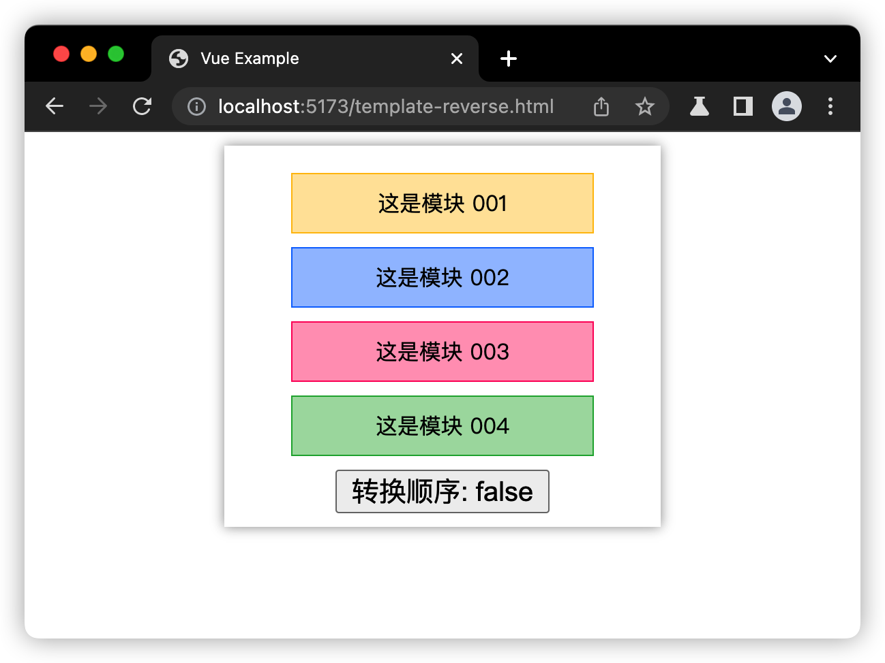
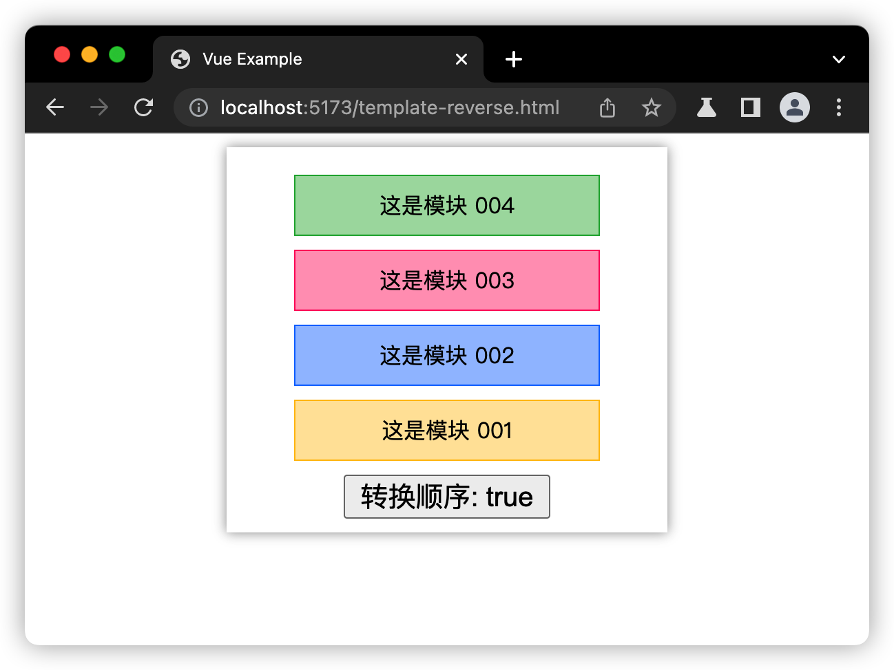

# 04｜模版语法和JSX语法：你知道Vue可以用JSX写吗？
你好，我是杨文坚。

前面几节课，我们讲解了很多Vue.js 3编译相关的内容，了解完Vue.js两个编译打包工具后，我们是时候要开始学习如何使用Vue.js 3进行实际的代码开发了。

这节课，我主要会从Vue.js的两种主要开发语法进行讲解，它们分别是模板语法和JSX语法。从中你不仅能了解到两种开发语法的差异，还可以知道怎么因地制宜地根据需求场景选择合适的语法，从而扩大个人的技术知识储备，更从容地应对用Vue.js 3开发项目过程中遇到的各种问题。

Vue.js从版本1.x到版本3.x，官方代码案例和推荐使用都是模板语法，那么这里我们也根据官方的推荐，优先来了解一下模板语法是怎么一回事。

## 什么是模板语法？

我们可以把Vue.js的模板语法，直接理解为 **HTML语法的一种扩展**，它所有的模板节点声明、属性设置和事件注册等都是按照HTML的语法来进行扩展设计的。按照官方的说法就是“所有的 Vue 模板都是语法层面合法的 HTML，可以被符合规范的浏览器和 HTML 解析器解析”。

现在我举个例子，带你了解下模板语法的概念及其不同内容的作用。代码如下所示：

```xml
<template>
  <div class="counter">
    <div class="text">Count: {{state.count}}</div>
    <button class="btn" v-on:click="onClick">Add</button>
  </div>
</template>

<script setup>
  import { reactive } from 'vue';
  const state = reactive({
    count: 0
  });
  const onClick = () => {
    state.count ++;
  }
</script>

<style>
.counter {
  padding: 10px;
  margin: 10px auto;
  text-align: center;
}

.counter .text {
  font-size: 28px;
  font-weight: bolder;
  color: #666666;
}

.counter .btn {
  font-size: 20px;
  padding: 0 10px;
  height: 32px;
  min-width: 80px;
  cursor: pointer;
}
</style>

```

这是基于 Vue.js 3的模板语法实现的加数器组件，代码基础结构都是基于HTML语法实现的，主要由视图模板、JavaScript脚本代码和CSS样式代码构成的。我们拆分开来具体看看。

**首先我们来看看视图层代码：**

```xml
<template>
  <div class="counter">
    <div class="text">Count: {{state.count}}</div>
    <button class="btn" v-on:click="onClick">Add</button>
  </div>
</template>

```

上述视图代码中，只能有一个最外层的template标签，template内部可以允许存在多个template标签，用来定义模板的“插槽”位置（slot）等更多插槽相关信息，你可以查看 [官方对插槽的说明](https://cn.vuejs.org/guide/components/slots.html) 了解一下。

Vue.js的模板可以直接使用HTML语法的属性（Attribute），例如class也可以直接在Vue.js的模板中使用，但是Vue.js自己定义了一些属性语法，例如 v-on，这个就是Vue.js模板绑定事件的语法。以此类推，你大概可以猜到大部分 Vue.js自定义的模板属性语法，都是以 “v-”为前缀的。更多Vue.js的模板语法，你可以查看 [官方文档](https://cn.vuejs.org/guide/essentials/template-syntax.html)。

**接下来我们看看JavaScript脚本代码：**

```xml
<script setup>
  import { reactive } from 'vue';
  const state = reactive({
    count: 0
  });
  const onClick = () => {
    state.count ++;
  }
</script>

```

在模板语法中，JavaScript代码只能放在script标签里，而且同一个文件里只能有一个顶级的script标签。

上述代码使用的是Vue.js的 Composition API，所以必须在script标签中声明 setup属性。我们后续所有内容都默认是基于 Composition API 来讲解Vue.js 3里的JavaScript代码操作。这是因为它是官方推荐的API使用方式，使用起来简单清晰，方便复用逻辑代码，同时这也是Vue.js 3诞生的特色。

**最后再来看下CSS样式代码：**

```xml
<style>
.counter {
  padding: 10px;
  margin: 10px auto;
  text-align: center;
}

.counter .text {
  font-size: 28px;
  font-weight: bolder;
  color: #666666;
}

.counter .btn {
  font-size: 20px;
  padding: 0 10px;
  height: 32px;
  min-width: 80px;
  cursor: pointer;
}
</style>

```

这些代码是模板语法里的CSS样式代码，具体使用方式跟HTML里使用CSS代码一致，唯一不同是可以加上scoped和lang属性。

scoped属性可以在编译Vue.js模板语法代码的时候，用随机数来定义样式选择器名称，保证CSS不会干扰页面上同名的CSS选择器，例如下面代码所示：

```xml
<div class="counter"></div>
<style scoped>
.counter { /*...*/ }
</style>

<!-- 当style加上scoped 后编译成 -->

<div class="counter" data-v-xxxxx></div>
<style>
.counter[data-v-xxxxx] { /*...*/ }
</style>

```

而lang属性可以赋值声明定义用了其它CSS语法，例如 lang="less"就是用了Less语法来写的CSS，但是需要在Vite等对应编译配置加上Less编译插件。

上面的整体代码就是用一个Vue.js 3模板语法实现一个组件，如果有一个组件需要引用这个“计数器”组件，就直接用import来引用就好了，代码如下：

```xml
<template>
  <div class="app">
    <Counter />
  </div>
</template>

<script setup>
import Counter from './counter.vue'
</script>

<style>
.app {
  width: 200px;
  padding: 10px;
  margin: 10px auto;
  box-shadow: 0px 0px 9px #00000066;
  text-align: center;
}
</style>

```

讲到这里，你是不是反应过来了，其实只要了解过HTML语法，就能很容易上手Vue.js的模板语法。而且，Vue.js从版本1.x到版本3.x，官方代码案例和推荐使用都是模板语法，因为模板语法更加简单易用。

不过，既然Vue.js官方代码案例和推荐使用都是模板语法，为什么官方还要实现一套与模板语法不同的JSX语法呢？

其实这个问题我们可以直接在Vue.js官网找到答案，官网就这么写着：“在绝大多数情况下，Vue 推荐使用模板语法来创建应用。然而在某些使用场景下，我们真的需要用到 JavaScript 完全的编程能力。这时渲染函数就派上用场了。”

这就是说，虽然官方推荐你用模板语法来写Vue.js 3代码，但是有些功能场景用模板语法可能会很难实现，甚至不能实现，那么就需要用到JSX语法来辅助实现了。而且，Vue.js在2.x版本时候已经开始支持JSX语法了。那么，Vue.js 3的JSX语法是怎样的呢？

## Vue.js 3的JSX语法是怎样的？

在讲解Vue.js 3之前，我先来给你分享一下，什么是JSX语法。

JSX语法，是JavaScript语法的一种语法扩展，支持在JavaScript直接写类似HTML的模板代码，你可以直接理解为“ **HTML in JavaScript**”。从目前在网上能找到的资料来看，JSX语法最早用于React.js，但不是React.js 独有的写法，目前有很多框架支持JSX写法，例如Vue.js和Solid.js（一种类似React.js写法的前端框架）等。

现在，我把上面的Vue.js 3的模板语法实现的“加数器”组件换成JSX语法实现，你可以对比看看这两个语法的实现差异，如下所示：

```javascript
import { defineComponent, reactive } from 'vue';

const Counter = defineComponent({

  setup() {
    const state = reactive({
      count: 0
    });
    const onClick = () => {
      state.count ++;
    }
    return {
      state,
      onClick,
    }
  },

  render(ctx) {
    const { state, onClick } = ctx;
    return (
      <div class="counter">
        <div class="text">Count: {state.count}</div>
        <button class="btn" onClick={onClick}>Add</button>
      </div>
    )
  }
});

export default Counter;

```

现在，我们类比模板语法，逐步分析下这个JSX语法实现的“加数器”组件。

JSX语法其实可以直接看做是纯JavaScript文件代码，在JavaScript文件代码里定义Vue.js 3组件可以通过API defineComponent来进行声明定义：

```javascript
import { defineComponent } from 'vue';
const Counter = defineComponent({
  // ...
})

```

而模板语法有组件视图层相关的代码，类比JSX语法里定义组件中的render方法，如下述代码所示：

```javascript
const Counter = defineComponent({
  // ...
  render(ctx) {
    const { state, onClick } = ctx;
    return (
      <div class="counter">
        <div class="text">Count: {state.count}</div>
        <button class="btn" onClick={onClick}>Add</button>
      </div>
    )
  }
  // ...
});

```

上述代码中，render函数返回的代码，就是JSX的写法，用来描述HTML模板内容。这里需要注意的是，所有JSX写法中都是用 **单大括号“{state.count}”来作为内部变量处理，而Vue.js 3模板语法是通过双大括号来表示“{{state.count}}”**，单大括号描述变量这个是JSX通用写法，Vue.js的JSX语法也是遵循了这个通用写法。

在模板语法中，模板的<script>标签里有一段JavaScript逻辑代码，这段JavaScript的逻辑代码，就是JSX语法中的defineComponent里除掉render函数外剩下的代码内容，如下代码：

```
const Counter = defineComponent({
  // 这里还可以是定义属性和组件引用
  props: {},
  components: {},

  // ...
  setup() {
    const state = reactive({
      count: 0
    });
    const onClick = () => {
      state.count ++;
    }
    return {
      state,
      onClick,
    }
  },
  // ...
});

```

看在这里，你会不会觉得少了什么东西？哈哈，是不是觉得少了CSS样式代码？模板语法中style存放的CSS代码，在JSX语法中，又是在哪个位置呢？

我们先回到最开始的JSX介绍中看看。我们说了，JSX其实也是JavaScript代码，在JavaScript代码中引用CSS代码，一般都是直接 import 对应的CSS文件。所以，在Vue.js中通过JSX语法开发组件，组件的CSS代码也是放在独立的CSS文件，最后通过import引用的，如下代码所示：

```javascript
import './counter.css'

```

到了这里，你是不是觉得JSX语法跟模板语法类比起来，都能找到一一对应关系，差别好像不是很大？

其实差别还是有的。只是因为上述的“加数器”组件案例只是简单的组件场景，而实际企业项目开发中我们会遇到很多五花八门的需求场景，这个时候模板语法和JSX语法的区别就体现出来了。接下来我就来讲解模板语法和JSX语法在实际项目中开发的有什么区别。

## 模板语法和JSX语法有什么区别？

首先，最大的区别就是模板语法能通过设置 **标签<style>属性scoped**，让CSS和对应的DOM在编译后能加上随机的CSS属性选择器，避免干扰其它同名class名称的样式。

而在JSX语法中并没有可以设置scoped的地方，所以JSX语法在使用样式class名称的时候，不能配置scoped避免CSS样式干扰。

除了样式的scoped配置差异外，还有更大的差异是体现在 **实现需求场景** 上，例如动态的组件渲染。假设我们现在有这么个需求，可以动态对组件进行顺序颠倒，如下述两张效果图所示：





这个需求如果要通过Vue.js 3的模板语法实现，可以这么写：

```xml
<template>
  <div class="app">
    <div v-if="isReverse === false">
      <Module01 />
      <Module02 />
      <Module03 />
      <Module04 />
    </div>
    <div v-else>
      <Module04 />
      <Module03 />
      <Module02 />
      <Module01 />
    </div>
    <button class="btn" @click="onClick">转换顺序: {{isReverse}}</button>
  </div>
</template>

<script setup>
import { ref } from 'vue';
import Module01 from './module01.vue';
import Module02 from './module02.vue';
import Module03 from './module03.vue';
import Module04 from './module04.vue';

const isReverse = ref(false);
const onClick = () => {
  isReverse.value = !isReverse.value;
}
</script>
<style>
/* 完整样式代码请看后续附带仓库链接 */
</style>

```

你可以看到，这个代码是通过一个变量isReverse来控制显示组件的正序和倒序，但是要写两次的顺序的模板代码，如下所示：

```xml
<div v-if="isReverse === false">
  <Module01 />
  <Module02 />
  <Module03 />
  <Module04 />
</div>
<div v-else>
  <Module04 />
  <Module03 />
  <Module02 />
  <Module01 />
</div>

```

这样子写代码虽然可以完成功能需求，但是会给后续的维护带来一定的难度。为什么这么说呢？这不是明明已经完成功能了吗，而且代码也很清晰呀，怎么会有后续维护难度呢？

这是因为企业中的需求是一直变化的。例如这次需求是实现组件的顺序的正序和倒序操作，那么如果下次要实现组件的其它排序，是不是意味着要多个变量来控制多个顺序的组件布局模板呢？这就会导致相关组件顺序控制的代码量翻倍增长。

这时候，JSX语法就可以来解决这种“动态”的问题了。我们再用JSX实现一次上述功能的代码，如下所示：

```javascript
import { defineComponent, ref } from 'vue';
import Module01 from './module01.vue';
import Module02 from './module02.vue';
import Module03 from './module03.vue';
import Module04 from './module04.vue';

const App = defineComponent({

  setup() {
    const isReverse = ref(false);
    const onClick = () => {
      isReverse.value = !isReverse.value;
    }
    return {
      isReverse,
      onClick,
    }
  },

  render(ctx) {
    const { isReverse, onClick } = ctx;
    const mods = [
      <Module01 />,
      <Module02 />,
      <Module03 />,
      <Module04 />
    ]
    isReverse === true && mods.reverse();
    return (
      <div class="app">
        {mods.map((mod) => {
          return mod;
        })}
        <button class="btn" onClick={onClick}>
          转换顺序: {`${isReverse}`}
        </button>
      </div>
    )
  }
});

export default App;

```

上述代码中，控制组件的动态顺序核心代码是这样的：

```javascript
const mods = [
  <Module01 />,
  <Module02 />,
  <Module03 />,
  <Module04 />
]
isReverse === true && mods.reverse();

```

你有没有发现，控制组件顺序的其实就是通过一个 **JSX的组件数组** 来进行的，如果后续遇到项目需求的变化，要求按各种顺序显示组件，那么我们只需要修改这个JSX数组的顺序就好了，不需要写多套顺序模板，是不是觉得代码量和维度难度一下子就降低很多呢？

不过，这时你可能会想挑战我：像这种动态顺序，如果项目团队用模板语法多写几次组件顺序也能接受的话，是不是等于JSX语法也没有优势呢？

那我们再来看一种场景，看看你如果不用JSX语法，能不能接受这样的维护成本。这个场景就是“动态组件的条件渲染”，例如常见的对话框条件显示：


如果用模板语法怎么来实现呢？我们先看对话框代码：

```xml
<template>
  <div v-if="props.show" class="v-dialog-mask">
    <div class="v-dialog">
      <div class="v-dialog-text">
        {{props.text}}
      </div>
      <div class="v-dialog-footer">
        <button class="v-dialog-btn" @click="onOk">确定</button>
      </div>
    </div>
  </div>
</template>
<script setup >
import { toRef, toRefs, computed } from 'vue';
const props = defineProps({
  text: String,
  show: Boolean,
});
const emits = defineEmits(['onOk']);

const onOk = () => {
  emits('onOk');
}
</script>
<style>
/* 完整样式代码请看后续附带仓库链接 */
</style>

```

再看使用对话框代码：

```xml
<template>
  <div class="app">
    <button class="btn" @click="onClickOpenDialog" >打开对话框</button>
  </div>
  <Dialog
    :show="showDialog"
    :text="showText"
    @onOk="onDialogOk"
  />
</template>
<script setup>
import { ref } from 'vue';
import Dialog from './dialog.vue';

const showDialog = ref(false);
const showCount = ref(0);
const showText = ref('温馨提示，这是一个对话框')

const onClickOpenDialog = () => {
  showDialog.value = true;
  showCount.value += 1;
  showText.value = `温馨提示，这是第${showCount.value}次打开对话框`
}

const onDialogOk = () => {
  showDialog.value = false;
}
</script>
<style>
/* 完整样式代码请看后续附带仓库链接 */
</style>

```

上述是用模板语法实现的对话框“条件动态”显示，你能看到，如果要控制一个对话框显示，不仅需要一个变量 showDialog 来控制，还需要把一个 <Dialog> 标签“埋在”模板里；如果后续有多个对话框显示，就需要控制多个变量和多个对话框标签。这样子代码虽然能运行，但是维护起来就比较冗余了。

那么换成JSX写法会是怎样呢？我这里给你看一下JSX写法的对话框组件：

```javascript
import { defineComponent, reactive, createApp, h, toRaw } from 'vue';

const Dialog = defineComponent({
  props: {
    text: String,
  },
  emits: [ 'onOk' ],
  setup(props, context) {
    const { emit } = context;
    const state = reactive({
      count: 0
    });
    const onOk = () => {
      emit('onOk')
    }
    return {
      props,
      onOk,
    }
  },
  render(ctx) {
    const { props, onOk } = ctx;
    return (
      <div class="v-dialog-mask">
        <div class="v-dialog">
          <div class="v-dialog-text">
            {props.text}
          </div>
          <div class="v-dialog-footer">
            <button class="v-dialog-btn" onClick={onOk}>确定</button>
          </div>
        </div>
      </div>
    )
  }
});

export function createDialog(params = {}) {
  const dom = document.createElement('div');
  const body = document.querySelector('body');
  body.appendChild(dom);
  const app = createApp({
    render() {
      return h(Dialog, {
        text: params.text,
        onOnOk: params.onOk
      })
    }
  });
  app.mount(dom)

  return {
    close: () => {
      app.unmount();
      dom.remove();
    }
  }
};

```

我们来分析上述JSX语法实现的对话框组件代码，核心思路是这样子的：

- 提供一个方法直接调用对话框渲染；
- 触发方法时候，在页面 `<body>` 标签上创建一个动态 `<div>` 标签；
- 用JSX生成对话框组件，挂载在这个动态 `<div>` 标签上，对话框显示；
- 调用方法返回一个对象，内置一个方法属性提供对话框的关闭操作。

使用时就是按照简单的方法使用，如下代码所示：

```javascript
import { createDialog } from './dialog';

// ...
const dialog = createDialog({
  text: `温馨提示，这是第${showCount.value}次打开对话框`,
  onOk: () => {
    dialog.close();
  }
});

```

如果要同时显示多个对话框，就直接执行多次调用，代码如下所示：

```javascript
import { createDialog } from './dialog';

// ...
const dialog1 = createDialog({
  text: `温馨提示，这是第1个对话框`,
  onOk: () => {
    dialog1.close();
  }
});

const dialog2 = createDialog({
  text: `温馨提示，这是第2个对话框`,
  onOk: () => {
    dialog2.close();
  }
});

```

你看这里的代码，是不是比起模板写法维护起来简单得多呢？只需要用单纯的方法调用来触发对话框就行了，不需要像模板语法那样，对每个对话框维护一个变量和标签。

看到这里，我们再来回顾一下刚刚提到的场景。“动态组件”场景下，相比模板语法，JSX有更加灵活的功能实现和后续代码维护。 **但是这个代码的开发和维护的难度并不是绝对的，而是相对的**。

为什么说是相对的呢？其实这个“难度相对”是针对人来说的，而不是技术本身。

因为不同开发者对两种语法的驾驭程度和理解程度不一样，虽然JSX语法比较灵活，但是要驾驭好，需要你有比较好的JavaScript设计思维。而模板语法虽然没有JSX语法那么灵活，但是它学习成本比较低，同时官方也有大量的模板语法的案例。

那么，现在引申出了一个问题，既然两种语法各有优点，同时它们开发和项目维护难度也是因人而异的，那么我们在企业的项目中如何选择这两种语法呢？

关于怎么选择，我这里就一个观点，用一句网络话语来讲就是“小朋友才做选择，大人们全都要”。

**其实两种语法不是互斥的，而是可以共存互相使用的**，所以在基于Vue.js 3开发的项目里，我们可以这么选择开发语法：

- 普通功能开发以模板语法为主，方便照顾到团队里不同技术能力程度的组员，让项目技术实现沟通起来方便些；
- 模板语法比较难实现的功能就换成JSX语法实现，例如一些对话框等动态组件场景，主要为了功能灵活实现和后续代码维护。

另外，你可能还会有疑问，官方推荐的开发语法就是模板语法，那如果我们要学习JSX语法有什么渠道呢？我的答案是多去借鉴一些使用JSX语法的成熟Vue.js 3开源项目，例如， [Ant Design Vue](https://github.com/vueComponent/ant-design-vue)、 [Vant UI](https://github.com/vant-ui/vant/) 等。

这些开源项目都是比较流行的 Vue.js 3 UI组件库，基本能覆盖大部分的企业项目前端开发场景。如果你遇到了某些场景想用JSX语法开发，可以去参考对应的组件的JSX语法设计。

## 总结

我们这节课主要介绍和对比了两种Vue.js 3的开发语法，模板语法和JSX语法。你从中可以理解到两种语法的差异和适用场景。

在面对普通功能开发中，我们可以选择模板语法进行开发，是基于模板语法的简易学习成本，方便团队组员的项目协同合作，在面对一些动态功能开发（例如对话框等动态渲染场景），可以选择JSX语法进行开发，让代码更灵活扩展和维护迭代。

但我不希望你只仅仅看到两种语法的使用场景，我希望你能从中理解到Vue.js 3开发语法的选择不是绝对根据语法的优缺点，而是要考虑到团队人员对技术的驾驭程度，如果团队成员是React.js转Vue.js，那么估计对JSX语法比较熟悉，强行统一用模板语法开发Vue.js 3项目估计不是一个最好的选择。

这也引申出一个概念，技术没有绝对的适用场景。在实际团队的项目开发中，要选择某种技术或者某种技术模式，不仅仅要考虑技术优缺点，还要考虑人员的能力程度，综合考虑选择出高效率的技术方案。

## 思考

前端开发组件经常会遇到组件的“递归使用”，也就是组件内部也循环使用了组件自己，那么，如何用模板语法和JSX语法处理组件的“自我递归使用”呢？

### [完整的代码在这里](https://github.com/FE-star/vue3-course/tree/main/chapter/04)