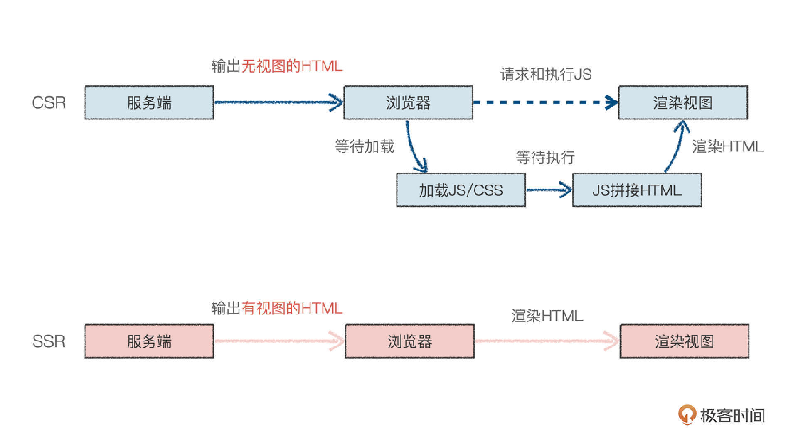
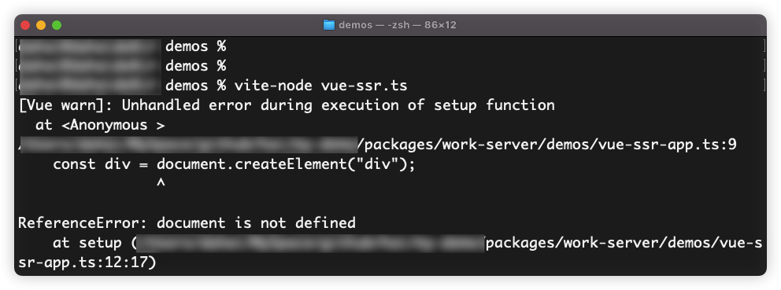
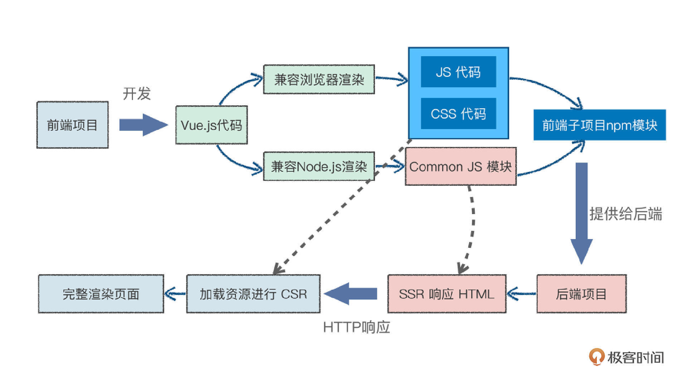
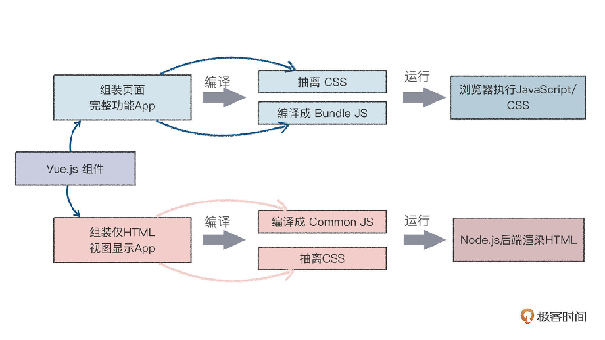
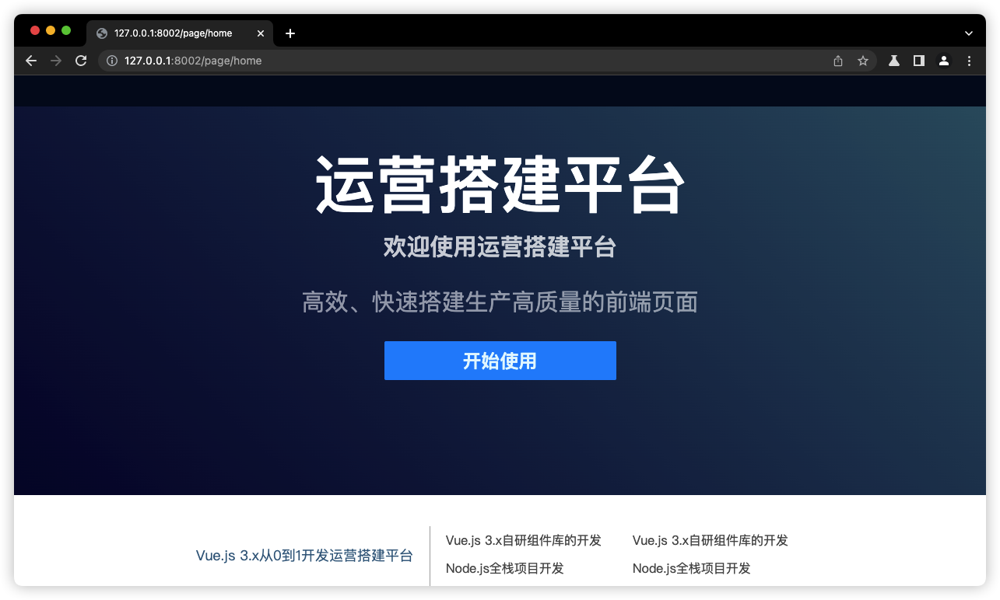

# 18｜Node.js服务端渲染页面：客户端渲染和服务端渲染有何区别？
你好，我是杨文坚。

之前，我们课上所有Vue.js的代码，都是在浏览器里运行的。在浏览器里，编译后的Vue.js源码是纯粹的JavaScript代码，可以直接执行，并渲染出对应的视图和交互效果。

但在JavaScript代码还没通过<script>标签加载出来之前，整个页面一直是“白屏”，这个状态要等待JavaScript加载完，才能渲染出页面的功能视图。就像图中这样，浏览器控制台记录的白屏过程：


为什么会有这个现象呢？

其实也很简单，因为图中渲染方式是“浏览器端渲染”，先等待页面的HTTP请求响应，返回页面的HTML，此时HTML还没有视图内容，只有JavaScript和CSS这些静态资源的引用，等到这些HTML里依赖的前端资源加载完毕后，最后执行JavaScript代码渲染出HTML结果，同时，对应CSS资源才会渲染样式效果。

如果请求页面依赖的资源文件体积太大，页面渲染就需要更长的等待时间，导致“白屏”时间等待太久，用户体验就很糟糕。

那么能不能无需等待JavaScript资源加载，就先渲染页面，来尽可能缩短“白屏”时间呢？

答案是有的，就是“服务端渲染”。究竟“浏览器渲染”和“服务端渲染”有什么渲染区别，带着这个问题，我们开始今天的学习。

## 什么是浏览器渲染和服务端渲染？

我们先从概念上理解一下这两个词。在前端领域里，“客户端”就是“浏览器”，所以“浏览器渲染”更官方的名称是客户端渲染。

- 客户端渲染，英文术语是 Client Side Render，简称CSR（后面我们就统一用CSR这个术语来表示）。

**“客户端渲染”就是通过浏览器中运行的JavaScript代码来生成HTML内容，从而渲染页面视图**。

在前端领域里，CSR除了渲染视图，更多是实现视图的交互操作，比如点击按钮后触发弹窗显示。因为这类交互操作，需要在浏览器里执行JavaScript代码绑定相关DOM的事件。

- 服务端渲染，英文术语是 Server Side Render，简称SSR（后面我们统一用SSR这个术语来表示）。

**SSR是由服务端处理好页面的HTML内容，再通过HTTP请求响应给浏览器渲染**。

具体技术过程是这样子的：浏览器输入URL发起了页面的HTTP请求，服务端接收请求后，再响应页面的HTML给浏览器，浏览器拿到页面HTTP请求返回的HTML数据，就可以开始渲染拿到的HTML的渲染视图了，如果HTML里有CSS内容，也会一并渲染出对应的样式。



所以， **CSR和SSR的最大区别就是“初始化页面视图时候”的“HTML生成方式”**，一个是在浏览器里拼接HTML，一个是在服务器里拼接HTML，这里的HTML也包括<style>标签里的CSS内容。

那么SSR的优势是什么呢？

SSR，是浏览器在请求页面URL的时候，直接返回视图的HTML内容，这意味着在其它环境里，例如另一个服务器环境里发起这个URL的HTTP请求，也能拿到这个HTML内容，所以 **服务端渲染还能支持搜索引擎抓取页面数据，也就是支持“SEO”**。

> SEO，全称是Search Engine Optimization，中文意思就是“搜索引擎优化”，比方说，SEO就是能让用户通过百度搜索找到网站网页的内容。
>
> 但是SEO不是搜索引擎单独一方就能完成的，需要多方的“合作”才能实现。
>
> 如果站在Web网站视角上，SEO就是要求Web网站提供一个能让搜索引擎“抓取”到数据的服务，让搜索引擎拿到网页的数据，做对应的页面关键字解析和收录。
>
> 如果站在搜索引擎视角上，SEO就是要求能通过搜索引擎的服务器来发起HTTP请求，拿到网页的HTML结果，然后归纳页面中的关键字，收录起来，等待用户搜索到关键字并提供对应网页链接。
>
> 如果站在其他用户视角上，就是用了某个搜索引擎，根据关键字来搜数据，如果关键字能对上，搜索引擎就显示对应收录的网页内容和链接。

我们小结一下两种渲染方式的作用：

- CSR：在浏览器里动态渲染HTML、在浏览器里实现交互效果；
- SSR：支持页面加载的首屏体验优化、支持网页的SEO（搜索引擎优化）。

之前我们都是在浏览器里做Vue.js的CSR，那么Vue.js如何做SSR呢？也就是说，如何实现Vue.js的服务端渲染呢？

## 如何实现Vue.js服务端渲染？

我们先分析一下Vue.js能在浏览器端实现渲染的原理，看看能不能找到参考思路。

CSR的原理就是，把Vue.js的模板语法代码或JSX语法代码，编译成纯JavaScript代码，然后通过Vue.js的runtime，也就是Vue.js的运行时，执行编译后的Vue.js代码，并渲染出对应的DOM（也就是HTML）和绑定DOM的事件。

浏览器搞懂了，那服务端呢？

先看第一个关键点，能执行JavaScript代码的服务端环境，必须首选Node.js环境。Vue.js官方也提供了Node.js的渲染方法，支持在Node.js环境里执行“非编译模式”的Vue.js代码，或者是编译后的Vue.js代码，将其转化成HTML结果。讲到这里，你有没有觉得很熟悉，这个“非编译模式”的使用就和我们已经学过的 [第一节课](https://time.geekbang.org/column/article/605412) 联动起来了。

那么第二个关键点，Vue.js是如何在Node.js的服务端渲染出HTML内容呢？我先跟你分析一下实现原理，基本分成两个步骤：

- 第一步，把Vue.js“非编译模式代码”或者“编译结果代码”转化成HTML字符串或数据流；
- 第二步，把HTML内容写入HTTP响应返回给浏览器。

第一步，就是Vue.js官方提供的API，支持将“非编译模式”的代码转化成HTML结果，我们看个例子。

这是编译后的Vue.js代码或者是“非编译模式”的Vue.js代码：

```typescript
// vue-ssr-app.ts
import { createElementVNode, ref, toDisplayString } from 'vue';
const Counter = {
  setup() {
    const num = ref(0);
    const click = () => {
      num.value += 1;
    };
    return () => {
      return createElementVNode('div', { class: 'v-counter' }, [
        createElementVNode(
          'div',
          { class: 'v-text' },
          toDisplayString(num.value)
        ),
        createElementVNode(
          'button',
          { class: 'v-btn', onClick: click },
          '点击加1'
        )
      ]);
    };
  }
};

export default Counter;

```

把Vue.js可执行的JavaScript代码，在Node.js转化成HTML：

```typescript
//  ./vue-ssr.ts
import { createSSRApp } from 'vue';
import { renderToString } from 'vue/server-renderer';

import App from './vue-ssr-app';

async function getAppSSRHTML() {
  // 将编译后或非编译模式的Vue.js组件或者页面进行SSR App转换
  const app = createSSRApp(App, {});
  // 将SSR App 生成HTML
  const html = await renderToString(app);
  return html;
}

async function main() {
  const html = await getAppSSRHTML();
  console.log(`最终拿到的HTML为： ${html}`);
}

main();

```

在这个例子中，我们使用的Vue.js代码，是可以在浏览器执行的JavaScript代码，之后通过Vue.js官方的两个API来处理转化HTML：

- 第一个API是createSSRApp，创建一个服务端渲染的应用，类似CSR里的createApp这个API，可以有效提取只能在服务端渲染的内容。
- 第二个API是renderToString，把SSR的应用转成HTML字符串。

上述代码最终执行结果如下图：


我们也可以使用另一个API renderToStream来代替renderToString，最终转化的结果是HTML数据流，是二进制的数据（后面为了方便显示生成HTML的字符串内容，演示代码我们都使用renderToString开发）。

完成第一步的HTML转化后，接下来就是 **第二步，把HTML的字符串结果或者数据流结果，通过Node.js的Web服务的HTTP响应操作，返回给浏览器**。

我们用Koa.js简单实现一个案例，具体代码如下所示：

```typescript
// vue-ssr-server.ts
import Koa from 'koa';
import { createSSRApp } from 'vue';
import { renderToString } from 'vue/server-renderer';
import App from './vue-ssr-app';

// 初始化 Koa.js 应用
const servre = new Koa();

servre.use(async (ctx) => {
  // 封装 Koa.js 中间件
  // 渲染 Vue.js 组件或应用的HTML内容
  const app = createSSRApp(App, {});
  const html = await renderToString(app);
  ctx.body = html;
});

servre.listen(6001, () => {
  console.log('SSR 服务已经启动，浏览器打开 http://127.0.0.1:6001/');
});

```

上述代码中，我用Koa.js搭建了一个简单的Web服务，并写了一个中间件来渲染Vue.js组件的HTML内容。

要特别注意的是， **在实现SSR的过程中，需要做好浏览器和Node.js各自独有的JavaScript API的判断隔离**。如果Vue.js组件或者应用代码里有浏览器的JavaScript API，在Node.js环境运行是会报错的，例如这个Vue.js的JavaScript代码：

```typescript
import { createElementVNode, ref, toDisplayString } from 'vue';

const Counter = {
  setup() {

    // 这是浏览器创建DOM的 JavaScript API
    // Node.js环境不存在
    const div = document.createElement('div');
    console.log(div);

    return () => {
      return createElementVNode('div', { class: 'v-counter' }, '测试');
    };
  }
};

export default Counter;

```

上述代码中存在浏览器操作DOM的JavaScript API，在Node.js环境里是不存在的，如果在Node.js执行SSR时候，会报错：



所以，当你在用Vue.js的组件或应用JavaScript代码进行SSR操作时候，要确保代码里不能有浏览器API，或者代码里要做好浏览器环境和Node.js的代码判断隔离。

另外，SSR还有一点需要注意，也可以说是缺点吧，SSR渲染出来的视图，只是静态的HTML内容。Vue.js组件里如果有交互事件，在SSR的渲染结果中是不会生效的。如果需要实现交互效果，就需要浏览器里执行相关的JavaScript代码，也就是需要CSR进行处理。

所以，这时候我们就需要CSR和SSR渲染的结合，那么如何设计Vue.js的SSR和CSR全栈项目呢？

## 如何设计全栈项目的Vue.js的SSR和CSR？

一提到SSR和CSR的结合渲染，你或多或少会想到一个技术术语——“同构渲染”。

但是，“同构渲染”这个概念，定义众说纷纭，有开发者认为一套前端代码能支持SSR和CSR，那就是“同构渲染”，但又有开发者认为SSR和CSR结合是“异构渲染”等等，争议很多。为了减少歧义，在课程中我们就只称之为Vue.js的SSR和CSR。

SSR和CSR的结合渲染，目前业界没有什么统一的技术方案，不同企业、不同开发者，具体实现形式都是“八仙过海各显神通”。

Vite官方提供了一个SSR和CSR结合渲染的案例： [https://github.com/vitejs/vite/tree/main/playground/ssr-vue](https://github.com/vitejs/vite/tree/main/playground/ssr-vue)，你可以参考学习，这个案例上手很简单轻便，但是前后端共用的Vue.js代码是耦合在一起的，不适合我们课程中设计的前后端分离项目。

既要支持前后端解耦分离的项目，又要支持一套Vue.js代码能兼容SSR和CSR两种渲染方式，该怎么办呢？

其实也很简单， **我们可以将同一套前端的Vue.js代码，做些兼容处理工作，编译出两套渲染代码，分别支持浏览器环境和Node.js环境的渲染**，具体设计思路是这样子的：



想实现图中的内容，需要四步：

1. 前端子项目Vue.js组件，编译成面向浏览器可运行的JavaScript代码；
2. 前端子项目Vue.js组件，编译成面向Node.js服务可以运行的JavaScript代码；
3. 后端子项目引用对应编译后的JavaScript代码，运行相关的结果；
4. 页面渲染时候，按照需要进行SSR或者CSR。

我们来一步步实现全栈项目的SSR和CSR的结合渲染。

**第一步**，前端子项目的Vue.js组件组装成功能页面代码，其中也包括所有交互功能的代码。这跟我们之前学过的编译操作、开发模式和生产模式一样，没什么太大区别。

**第二步**，根据需要，把Vue.js组件按需组装SSR所需要渲染的内容，这时候可以按照需要，选择页面的Vue.js组件，尽量只选择首屏需要的组件或者SEO需要用到的组件。记得同时做好Node.js环境的JavaScript API兼容。

封装好需要SSR页面的Vue.js代码，就编译成CommonJS模块格式，虽然Node.js现在已经支持ES Module模块格式，但考虑兼容性问题，还是以CommonJS模块格式提供出来比较稳妥。与此同时，所有页面编译出的都是独立CommonJS文件和CSS文件。具体流程我用一张图来描述：



**第三步**，在Node.js服务项目中，通过服务端路由解析出不同页面的ID或者页面名称，查找是否存在SSR的CommonJS模块代码：

- 如果存在，就获取CommonJS模块和对应的CSS代码，通过Vue.js的SSR API进行转换成HTML，最后响应给浏览器，完成一个SSR流程和后续在浏览器里的CSR流程。
- 如果页面的SSR CommonJS代码不存在，就响应默认的HTML，走普通的CSR流程。


**第四步**，观察和等待浏览器的执行。我拿这节课的源码案例来演示一下最终效果，用SSR+CSR渲染了运营平台的首页：



用了SSR+CSR的开发模式，在控制台看到的渲染效果如下：


如果去掉SSR，仅用CSR，就会出现白屏等待的体验问题：


具体代码实现，你可以在课后查看课程GitHub上的源码案例。

## 如何合适地选择使用SSR？

从分析和案例效果都可以看出，SSR能减少白屏的时间，甚至白屏的时间可以忽略不计。那，是不是SSR就是项目开发必备的能力呢？或者说SSR合适所有项目场景吗？

其实不是的，并不是所有页面都需要SSR。

主要原因是有些场景是不希望支持SEO的。因为 **有些页面是不想被浏览器引擎“抓取”页面数据的**，避免一些业务数据被竞对批量获取。比如一些电商网站，就不想让搜索引擎拿到商品价格，这时候，页面渲染方式用纯CSR比较合适。

除了因为数据安全问题不适合SSR外，还有另一个不适合的场景， **高并发大流量的服务场景**。因为SSR在处理HTML过程中需要拼接字符串等操作行为，这个过程要消费内存和CPU的资源。如果此时SSR过程还需读取数据填充到HTML里，再加上读写数据的等待时间和服务器资源消耗，会带来很大的服务器压力。

所以，如果涉及数据敏感、服务器压力的场景，我们就不合适用SSR。当然这只是直观的选择方式，如果企业内有专业的数据安全团队和服务运维团队辅助，他们可以支持数据“防爬”和服务动态扩容，那么这两类问题场景也不是问题，可以愉快使用SSR。

## 总结

通过今天的学习，相信你已经掌握了Vue.js关于SSR和CSR的原理以及利弊，我们总结一下两种渲染方式。

- CSR，也就是客户端渲染或浏览器渲染，依赖JavaScript资源的加载，需要加载完后执行，动态生成HTML视图和实现交互功能。

主要作用是交互功能的实现，缺点是依赖JavaScript等资源的加载，可能导致渲染页面出现“白屏”等待时间过长。 **CSR适合数据敏感的网页，避免搜索引擎或“爬虫”来“抓取”网页数据**，例如电商价格显示的详情页。

- SSR，也就是服务端渲染，在服务端处理HTML结果，并返回给浏览器直接渲染，主要作用是缩短页面渲染时间和支持搜索引擎“抓取”网页数据。

SSR适合SEO场景，例如运营推广类的活动页面宣传。但是要考虑数据安全问题和服务运维成本问题。 **Vue.js代码在SSR时，注意要做好浏览器的JavaScript API的兼容判断或者隔离，避免出现程序运行异常。**

至于如何因地制宜定制Vue.js全栈项目的SSR和CSR结合方案，核心要考虑项目的前后端耦合或者解构的情况，同时还要考虑到国内大厂的前后端分离的技术趋势。SSR和CSR的设计方案，必须让Vue.js在前后端的使用操作上解耦。

今天我们是从前后端项目分离的角度上做方案设计，但技术趋势在不停变化发展，除了掌握今天的技术设计方案，希望你也能灵活地做好设计方案的变通。

## 思考题

单页面应用如何优雅设计Vue.js项目的SSR和CSR？

欢迎积极留言参与讨论，我们下节课见。

### [完整的代码在这里](https://github.com/FE-star/vue3-course/tree/main/chapter/18)