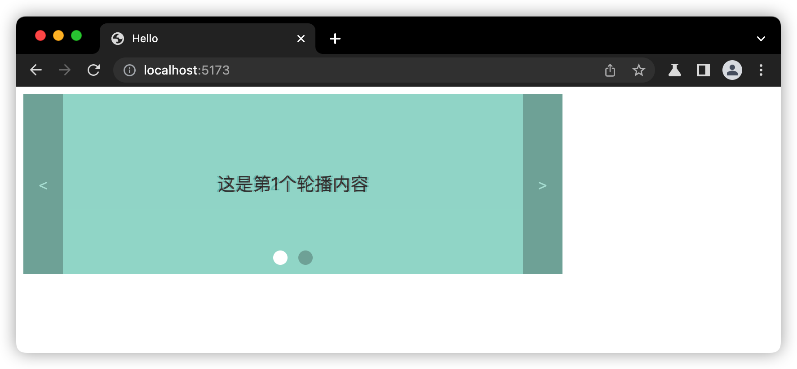
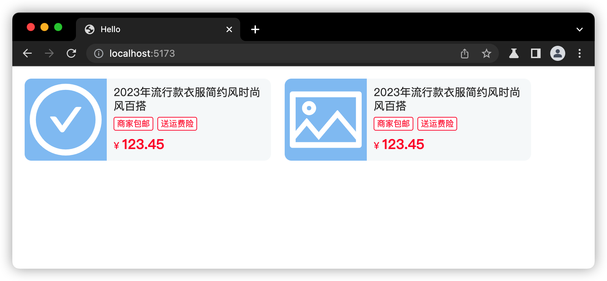
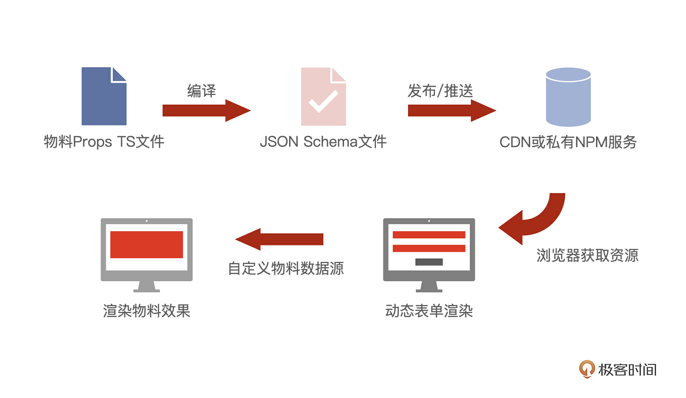
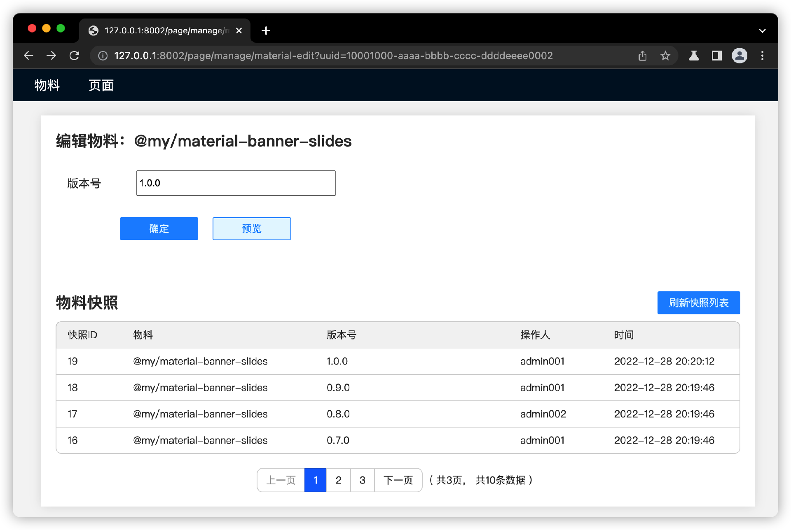
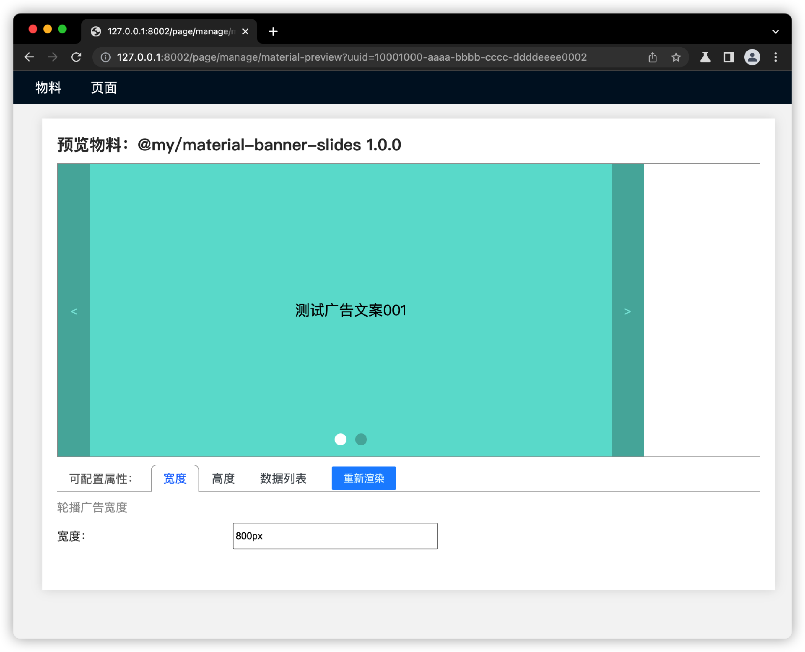
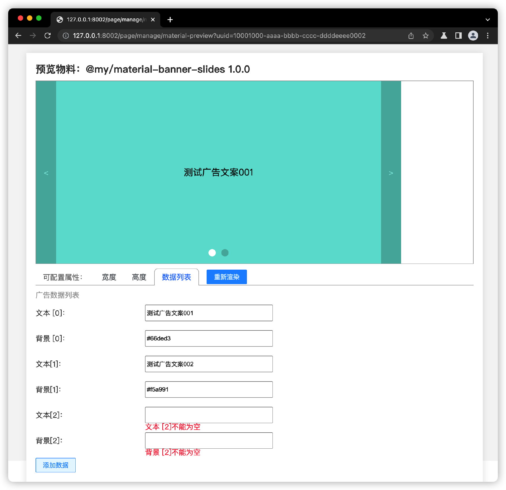

# 24｜后台搭建数据源：如何设计运营搭建页面的数据结构？
你好，我是杨文坚。

前两节课，我们学习了物料的“资源管理”和“数据管理”，一起构成了我们课程运营搭建平台的物料功能维度。

不知道你没有想过，在运营搭建平台中，对物料进行资源和数据管理后，要怎么预览物料效果呢？如果能预览物料效果，那能不能进一步自定义物料的效果，比如通过传入自定义的数据，来控制物料的显示内容或者操作功能？

答案当然是可以的，那怎么具体实现物料效果的预览和自定义呢？我们开始今天的学习。

## 实现思路分析

对我们课程的运营搭建平台项目来说，用到的物料，其实就是Vue.js组件。

如果要让组件实现预览效果，可以直接把组件单独当做应用来运行。

如果要自定义物料显示效果，就要做两方面支持，一方面是物料的Vue.js组件在开发的时候，必须支持通过Props来自定义控制部分内容，另一方面，在组件运行的时候，支持通过Props传入自定义的数据，让物料组件根据代码逻辑，展现出自定义效果。

搭建页面，是通过一个个物料组装而成的，页面的数据，其实就是物料的数据。所以，页面的数据也就是物料的数据，页面的数据结构，也就是物料的数据结构。

同时，在同一个页面上，我们还可以多次使用同一物料的Vue.js组件，传入不同的Props数据，来重复使用同一个物料，达到不同的渲染效果。

具体怎么实现呢，我们先要掌握一个概念，物料的数据结构，也就是“物料数据源”，或者简称“数据源”。

## 什么是物料数据源

“数据源”，这个词听起来有点技术的味道，但在我们课程的运营搭建平台项目里，“数据源”属于一种业务概念，指给物料提供自定义的数据，让物料根据组件里的代码逻辑，渲染自定义内容，也可以让同一个物料组件，在同一个页面上复用多次，使用不同数据源，来渲染不同的效果。

为什么我会说“数据源”是“业务上的定义”呢？

因为它其实是项目开发者或者管理者在项目内部约定的一种业务概念。比如在“搭建页面项目”或者“低代码项目”里，“数据源”可以被定义成一种HTTP请求的数据来源，不一定是笼统的物料配置数据。

**在我们课程的项目里，所有的“数据源”都是指“物料数据源”，用来给物料的Vue.js组件传入自定义数据的，就是单纯的Vue.js组件的Props配置数据**，不会具体指哪种HTTP请求API类型。这样设计，可以方便我们以后按“业务需求”，直接把配置数据，替换成实际的HTTP数据接口。

同时，课程里提到的“页面数据结构”，其实也就是组成页面的“物料数据源的组成”，也是一种“业务概念”，不是技术概念（这里用“页面数据结构”是为了跟“物料数据源”做区别，进行“业务概念”上的区分）。

对数据源概念达成一致之后，接下来，我们来看看怎么设计数据源的“数据描述格式”。

毕竟，不同功能的物料，背后实现的Vue.js组件是不一样的，那么组件的Props也是不一样的。例如，广告轮播Vue.js组件传入的Props是广告数据，商品促销Vue.js组件传入的Props是商品列表数据，这两种数据的Props数据格式都是不一样的。

我们看一个实际的代码例子。

先看课程代码案例里的广告轮播物料组件@my/material-banner-slides，Props的TypeScript数据类型是这样子的。

```typescript
export interface MaterialProps {
  width: number | string;
  height: number | string;
  banners: Array<{
    text: string;
    background: string;
  }>;
}

```

根据这个数据类型，具体传入自定义数据可以这么来定义。

```json
{
  width: 600,
  height: 200,
  banners: [
    {
      text: '这是第1个轮播内容',
      background: '#66ded3'
    },
    {
      text: '这是第2个轮播内容',
      background: '#f5a991'
    }
  ]
}

```

给轮播物料的Vue.js组件，传入上面格式的Props自定义数据后，渲染效果图就像这样。



对比看一下课程的商品促销组件@my/material-product-list，Props的TypeScript数据类型是这样子的。

```typescript
export interface MaterialProps {
  productList?: Array<{
    id: string;
    title: string;
    labels: string | string[];
    imageUrl: string;
    price: string;
  }>;
}

```

根据数据类型，具体传入自定义数据可以这么来定义。

```json
{
    productList: [
    {
      id: '00001',
      title: '2023年流行款衣服简约风时尚风百搭',
      labels: '商家包邮,送运费险',
      imageUrl: 'https://xxxxxxxxx',
      price: '123.45'
    },
    {
      id: '00002',
      title: '2023年流行款衣服简约风时尚风百搭',
      labels: '商家包邮,送运费险',
      imageUrl:'https://xxxxxxxxx',
      price: '123.45'
    }
  ]
}

```

给商品促销的Vue.js组件，传入上面格式的Props自定义数据后，渲染效果图就是这样的。



通过这两个物料的Vue.js案例，我们可以知道，传入的数据源是JSON对象类型，实际搭建页面配置的物料数据源，也是把JSON数据存到数据中。

但是，问题来了，不同物料的JSON数据是不一样的，总不能让运行搭建平台的用户在配置每个物料数据源的时候，都直接输入JSON数据吧？怎么办呢？

其实，“输入JSON数据”就像“解答题”， **我们可以通过动态表单来生成JSON数据，变成用户只需要在表单上输入个别数据的“填空题”**。

想要用动态表单来支持实现，提供表单的操作，支持不同JSON数据格式的编辑，也就意味着要把不同物料数据源的JSON数据格式进一步抽象，用统一的描述格式，来描述JSON数据格式。简单来讲就是把需要“描述JSON数据格式的格式”，转成“动态表单配置JSON数据对象”，最后动态渲染表单，提供给用户编辑物料数据源。

所以，第一步我们需要有“描述JSON数据格式的格式”，来定义描述物料数据源的JSON数据的数据结构，也就是JSON Schema。

## 什么是JSON Schema

从JSON Schema的官方网站 [https://json-schema.org/](https://json-schema.org/) 我们可以看到介绍。

> JSON Schema is a declarative language that allows you to annotate and validate JSON documents. JSON Schema enables the confident and reliable use of the JSON data format.

翻译过来就是，“JSON Schema 是一种声明式的语言，允许通过它进行注释和验证JSON文档。 JSON Schema 让JSON数据格式的使用变得可靠和确定。”简单讲，就是“用JSON来描述JSON格式”，或者是“JSON数据的数据结构”。

你听起来可能还是有点拗口，我们看几个例子，你就能明白了。

第一个例子，一个JSON对象数据。

```json
{
  "abc": 123
}

```

这个数据有一个属性“abc”，属性值为123的数字，用JSON Schema来描述的话就是这段代码。

```json
{
  "type": "object",
  "properties": {
    "abc": {
      "type": "number"
    }
  },
  "$schema": "http://json-schema.org/draft-07/schema#"
}

```

这段代码就是JSON Schema，它描述了一个JSON数据，拥有一个属性“abc”，属性值为数字，可以描述任何数字内容，不一定是具体的数字“123”。同时，JSON Schema有个“$schema”属性，代表是基于JSON Schema的草案版本。

接下来看第二个例子，也是个JSON对象数据。

```json
{
  abc: [1, 2, 3, 4]
}

```

这个数据有一个属性“abc”，属性值是“数字数组”，用JSON Schema来描述就是这段代码。

```json
{
  "type": "object",
  "properties": {
    "abc": {
      "type": "array",
      "items": {
        "type": "number"
      }
    }
  },
  "$schema": "http://json-schema.org/draft-07/schema#"
}

```

这个JSON Schema描述一个JSON对象数据，有一个属性“abc”，类型为“数字数组”。

前两个JSON数据例子比较简单，我们再看一个更复杂的，这个代码里有“数组和对象嵌套”，也就是“对象数组格式”的JSON数据。

```json
{
  abc: [
    { a: 1, b: 'hello', c: true },
    { a: 2, b: 'hello', c: false }
  ]
}

```

JSON Schema可以描述成这样。

```json
{
  "type": "object",
  "properties": {
    "abc": {
      "type": "array",
      "items": {
        "type": "object",
        "properties": {
          "a": {
            "type": "number"
          },
          "b": {
            "type": "string"
          },
          "c": {
            "type": "boolean"
          }
        }
      }
    }
  },
  "$schema": "http://json-schema.org/draft-07/schema#"
}

```

这三个例子，就是大部分常见JSON数据的JSON Schema描述，更多使用方式你可以查看官方文档 [https://json-schema.org/](https://json-schema.org/) 。

现在，我们知道怎么用JSON Schema，来统一描述组件的Props数据格式了。

但是你估计也发现了，描述一个简单的JSON数据格式，用到的JSON Schema描述都会很繁琐，不可能每个物料的Vue.js组件在开发的时候，都人工来手写物料数据源的JSON Schema吧？有没有办法在物料Vue.js组件过程中，就能根据组件Props的TypeScript数据类型，自动生成JSON Schema呢？

## 如何自动生成数据源的数据结构

要自动生成物料数据源的JSON Schema，就是要自动生成数据源的数据结构，核心就是基于物料Vue.js组件的Props类型描述。

换句话说，就是要 **直接基于Vue.js组件中Props的TypeScript类型描述，自动生成JSON Schema**，来保证JSON Schema跟组件的Vue.js组件的Props数据类型描述的一致，避免出现物料数据源描述和Vue.js组件Props TypeScript类型割裂，带来的技术和业务功能的割裂。

那么有没有实际的技术方法，可以把TypeScript数据类型转成JSON Schema，保证数据源描述和代码类型的一致性呢？答案是有的，就是使用 typescript-json-schema 这个npm模块，可以把指定的TypeScript数据类型，转成JSON Schema。

我用一个案例给你描述一下具体使用方式。

首先准备文件目录。

```shell
.
├── transform.ts
└── types.ts

```

在文件中，types.ts文件为TypeScript类型描述文件，看代码。

```typescript
export interface TestType {
  /**
   * 轮播广告宽度
   *
   * @title 宽度
   */
  width: number | string;
  /**
   * 轮播广告高度
   *
   * @title 高度
   */
  height: number | string;

  /**
   * 广告数据列表
   *
   * @title 数据列表
   */
  banners: Array<{
    /**
     * 广告文本
     *
     * @title 文本
     */
    text: string;
    /**
     * 广告背景
     *
     * @title 背景
     */
    background: string;
  }>;
}

```

另外的文件transform.ts，是使用typescript-json-schema的操作，看代码。

```typescript
import path from 'node:path';
import fs from 'node:fs';
import * as TJS from 'typescript-json-schema';

function buildTypeSchema() {
  const basePath = path.join(__dirname);
  const filePath = path.join(__dirname, 'types.ts');
  const distPath = path.join(__dirname, 'types.schema.json');
  const settings: TJS.PartialArgs = {
    // required: true,
    // titles: true
  };
  const compilerOptions: TJS.CompilerOptions = {
    strictNullChecks: true
  };
  const program = TJS.getProgramFromFiles(
    [filePath],
    compilerOptions,
    basePath
  );
  const schema = TJS.generateSchema(program, 'TestType', settings);
  const schemaStr = JSON.stringify(schema, null, 2);
  fs.writeFileSync(distPath, schemaStr);
}

buildTypeSchema();

```

准备好测试代码，我们就来执行代码。

我们可以通过ts-node或者vite-node来启动TypeScript代码，我就直接用vite-node来运行操作代码。

```typescript
vite-node ./transform.ts

```

命令执行后，启动了transform.ts文件的代码，把types.ts文件里的TestType类型，编译成JSON Schema，生成JSON Schema的JSON文件，就是这段代码。

```typescript
{
  "type": "object",
  "properties": {
    "width": {
      "description": "轮播广告宽度",
      "title": "宽度",
      "type": [
        "string",
        "number"
      ]
    },
    "height": {
      "description": "轮播广告高度",
      "title": "高度",
      "type": [
        "string",
        "number"
      ]
    },
    "banners": {
      "description": "广告数据列表",
      "title": "数据列表",
      "type": "array",
      "items": {
        "type": "object",
        "properties": {
          "text": {
            "description": "广告文本",
            "title": "文本",
            "type": "string"
          },
          "background": {
            "description": "广告背景",
            "title": "背景",
            "type": "string"
          }
        }
      }
    }
  },
  "$schema": "http://json-schema.org/draft-07/schema#"
}

```

通过的上面方式，我们可以约定每个物料Vue.js组件开发的时候，用一个types.ts文件来声明使用Props类型，最后编译的时候，用typescript-json-schema统一编译出Props的JSON Schema。

好，我们现在知道“数据源”“JSON Schema”，以及物料数据源的JSON Schema的自动生成方式，那么我们就把这些知识点串联起来，来实现一个物料的数据源配置功能。

## 如何实现物料数据源配置功能实现

这里的“物料数据源配置功能”，就是根据不同物料，显示对应的配置表单，提供给用户进行配置数据。当用户配置完自定义数据后，可以预览到物料对应的渲染效果。换句话说，其实就是要实现物料的预览功能。

我这里做了一个技术方案。



可以看到“物料预览功能”的完整实现，需要依赖四个步骤。

- 第一步：生成物料数据源JSON Schema。
- 第二步：物料数据源JSON Schema和物料静态资源一起管理。
- 第三步：基于JSON Schema生成动态表单。
- 第四步：把物料隔离渲染。

我们详细分析每一个步骤的技术实现。

第一步，生成物料数据源JSON Schema。就是在物料组件开发的时候，约定独立的TypeScript的类型文件，描述物料的Vue.js组件的Props类型。

我在课程代码案例中两个物料组件 @my/material-banner-slides 和 @my/material-product-list，都统一约定用types.ts文件，来描述Vue.js组件Props的TypeScript数据类型。最后通过脚本，在编译组件时候，把Props的TypeScript类型编译成JSON Schema，以独立的JSON文件进行存储。

第二步，物料数据源JSON Schema和物料静态资源一起管理。这一步，就是把独立的JSON Schema数据文件，跟随物料的JavaScript和CSS文件，发送到CDN或者私有NPM服务。课程代码案例就存储在monorepo的mock-cdn中，也就是课程代码案例的模拟CDN中。

第三步，基于JSON Schema生成动态表单。在这个步骤中，浏览器会请求物料组件的JSON Schema文件，把JSON描述数据转成动态表单的字段数据，最后渲染出动态表单，给用户自定义数据配置使用。

第四步，把物料隔离渲染。我们把动态表单配置数据后，传入物料的Vue.js组件，让它运行自定义数据。

同时，这里渲染物料Vue.js组件的时候，为了避免样式和全量变量干扰，我们就用iframe来隔离渲染组件，并且传入自定义的数据源数据。

这是拼接物料Vue.js组件独立渲染的HTML内容。

```typescript
// packages/work-front/src/pages/manage/utils/srcdoc.ts
export function createIframeDocument(data: {
  name: string;
  version: string;
  props: any;
}): string {
  const { name, version, props = {} } = data;
  const { origin } = window.location;
  const doc = `
<html>
  <head>
    <style>html, body { margin: 0; padding: 0; }</style>
    <script type="importmap">
      {
        "imports": {
          "vue": "${origin}/public/cdn/pkg/vue/3.2.45/dist/vue.runtime.esm-browser.js",
          "${name}": "${origin}/public/cdn/material/${name}/${version}/index.esm.js"
        }
      }
    </script>
  </head>
  <body>
    <div id="app">${name} - ${version}</div>
  </body>
  <script type="module">

    async function loadMaterialStyle(params) {
      const { name, version } = params;
      if (document.querySelector('style[data-material-id="${name}"]')) {
        return;
      }
      const url = \`${origin}/public/cdn/material/${name}/${version}/index.css\`;
      const text = await fetch(url).then((res) => res.text());
      const style = document.createElement('style');
      style.setAttribute('data-material-id', "${name}");
      style.innerHTML = text;
      const head = document.querySelector('head');
      head?.appendChild(style);
    }

    async function main() {
      const Vue = await import('vue');
      const Material = await import('${name}');
      await loadMaterialStyle({ name: '${name}', version: '${version}'  })

      const props = ${JSON.stringify(props)};
      const App = Vue.h(Material.default || Material, {...props});
      const app = Vue.createApp(App, {});
      app.mount('#app');
    }
    main();
  </script>
</html>
`;

  return doc;
}

```

最终结果传入iframe的srcdoc属性中，渲染动态子页面，达到隔离环境，独立渲染Vue.js组件的效果。看具体实现的核心功能代码。

```xml
<!-- packages/work-front/src/pages/manage/views/material-preview.vue -->
<template>
  <div class="view-material-preview">
    <div class="view-header">
      <div class="view-title">
        <span>预览物料：</span>
        <span>{{ model.name }} {{ model.currentVersion }}</span>
      </div>
    </div>
    <div class="view-content">
      <iframe class="preview-iframe" :srcdoc="iframeSrcDoc"></iframe>
    </div>
  </div>
</template>

<script lang="ts" setup>
import { Message } from '@my/components';
import { onMounted, reactive, ref } from 'vue';
import { useRoute } from 'vue-router';
import { createIframeDocument } from '../utils/srcdoc';

const route = useRoute();
const iframeSrcDoc = ref<string>('');

interface MaterialData {
  uuid: string;
  name: string;
  currentVersion: string;
  info: string;
  extend: string;
  createTime?: string;
  modifyTime?: string;
}
const model = reactive<MaterialData>({
  uuid: '',
  name: '',
  currentVersion: '',
  info: '',
  extend: ''
});

onMounted(() => {
  fetch(`/api/get/material/data?uuid=${route.query?.uuid}`)
    .then((res) => res.json())
    .then((result) => {
      Message.open({
        type: result.success ? 'success' : 'error',
        text: result.message,
        duration: 2000
      });
      if (result.data) {
        const data = result.data;
        model.uuid = data?.uuid;
        model.name = data?.name;
        model.currentVersion = data?.currentVersion;
        model.info = data?.info;
        model.extend = data?.extend;
      }
      iframeSrcDoc.value = createIframeDocument({
        name: model.name,
        version: model.currentVersion,
        props: {}
      });
    })
    .catch((err: Error) => {
      Message.open({
        type: 'error',
        text: `获取信息 [${err.toString()}]`,
        duration: 5000
      });
    });
});
</script>

```

最终效果就是这样。



点击图中物料编辑页面的“预览按钮”，进入物料效果的预览页面，可以自定义编辑物料的数据源。





## 总结

经过这节课的学习，相信你已经掌握了物料数据源（也就是页面数据结构）的设计与实现。今天我们主要学习了三个要点“物料数据源”“JSON Schema”和“物料预览功能的实现”。

“物料数据源”是一个“业务层面”的概念，不是技术概念，不同项目和团队的称呼可能有点差异，我们课程里的“数据源”就是物料的自定义数据，让物料能自定义渲染内容。额外提一下，页面的数据结构中的“数据结构”也是一种“业务层面”的概念，由物料的“数据源”组成，就是课程的“页面数据结构”。

JSON Schema是一种技术规范或技术语言，是基于JSON格式来描述JSON数据格式， **你可以直接理解成“描述JSON的JSON”，可以用约定统一的JSON语法，来实现对任何JSON数据的描述**。在实际技术开发工作中，不仅作为JSON数据描述，也可以通过一些校验工具（例如ajv这个npm模块）基于JSON Schema来对JSON数据做校验。所以，今天的JSON Schema其实也是一种技术方案储备。

至于怎么实现“物料的预览功能”，核心的技术点就是“如何动态实现iframe 文档内容”，你可以通过iframe的srcdoc属性，动态传入完整的HTML内容，隔离动态渲染出HTML内容的子页面。

## 思考题

既然可以把TypeScript数据类型编译转成JSON Schema，那么有没有技术可以把JSON Schema编译转回TypeScript代码数据类型呢？

期待你的思考，希望你今天学有所获，解锁新的技术技能，储备新技术知识。我们下节课见。

### [完整的代码在这里](https://github.com/FE-star/vue3-course/tree/main/chapter/24)