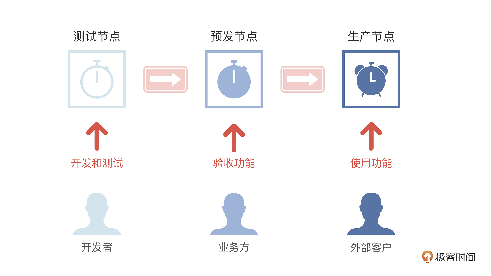
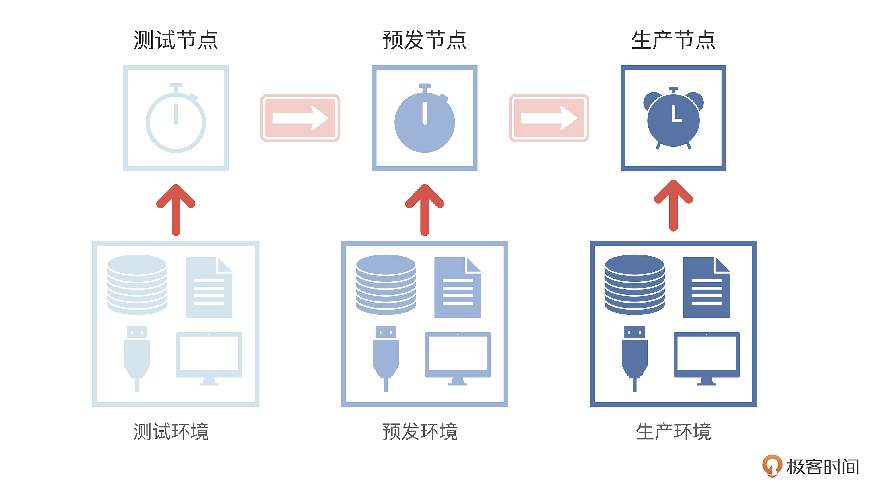
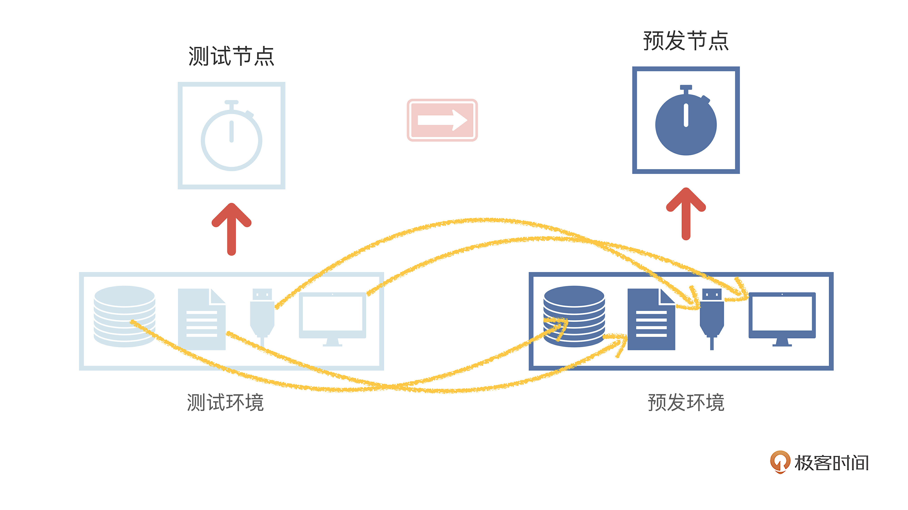
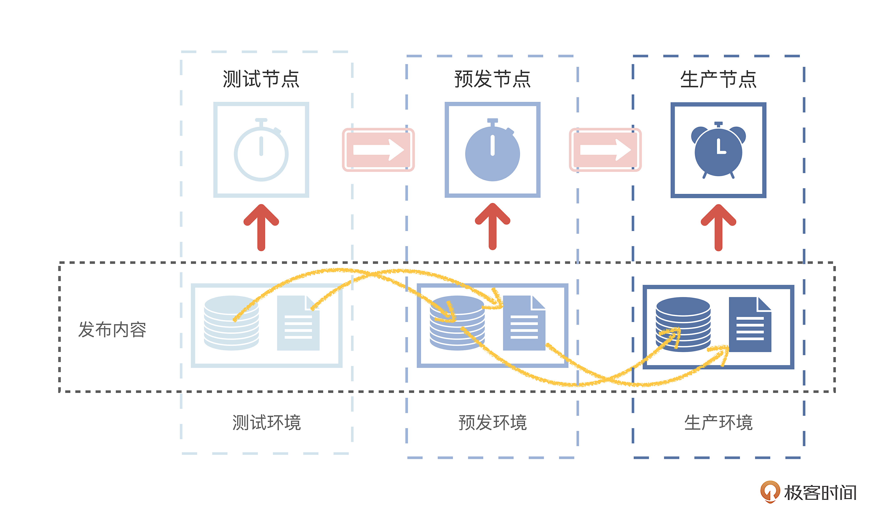
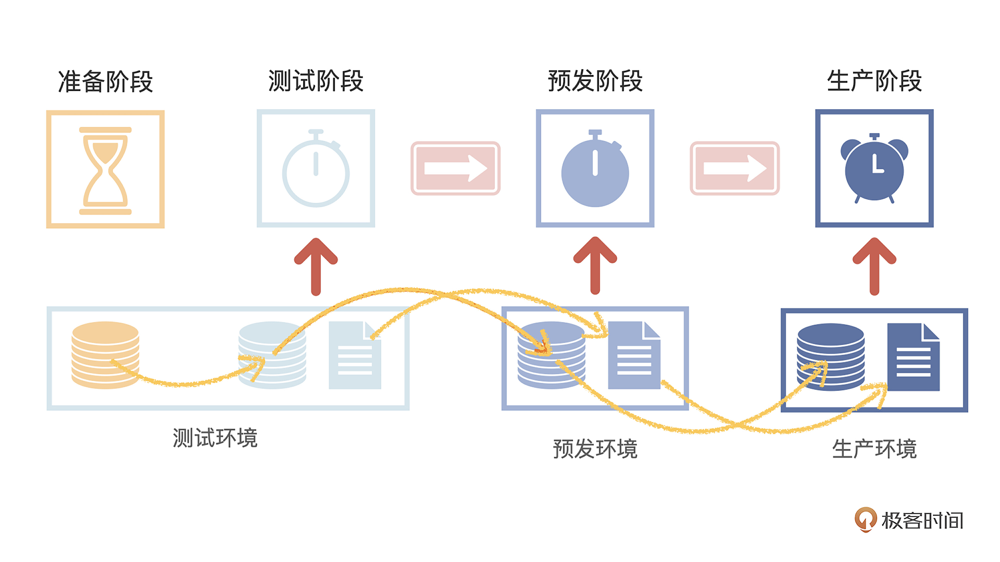
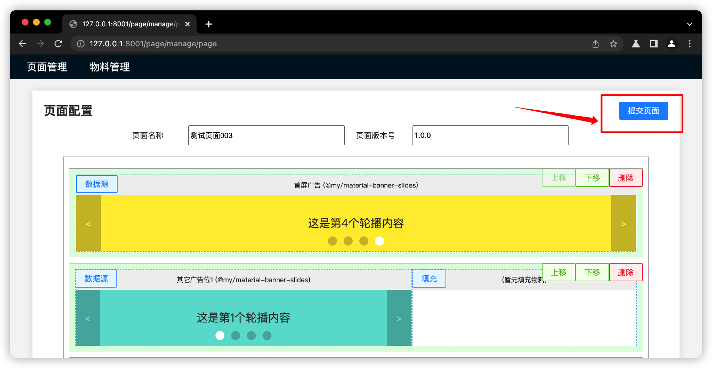
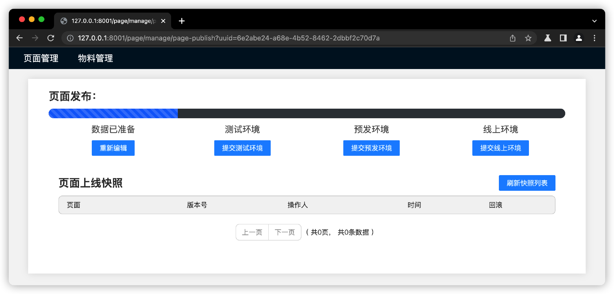
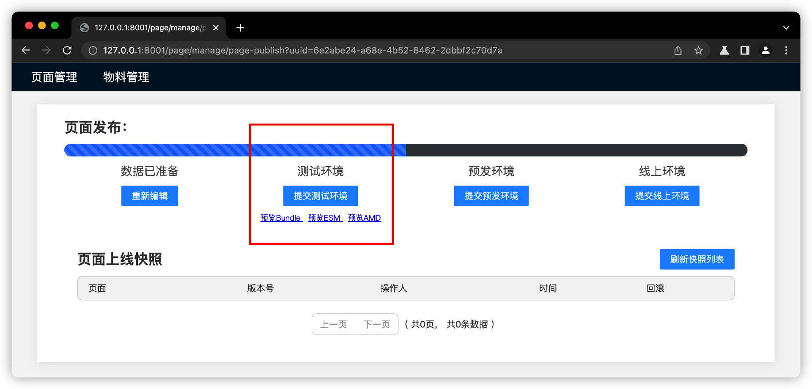
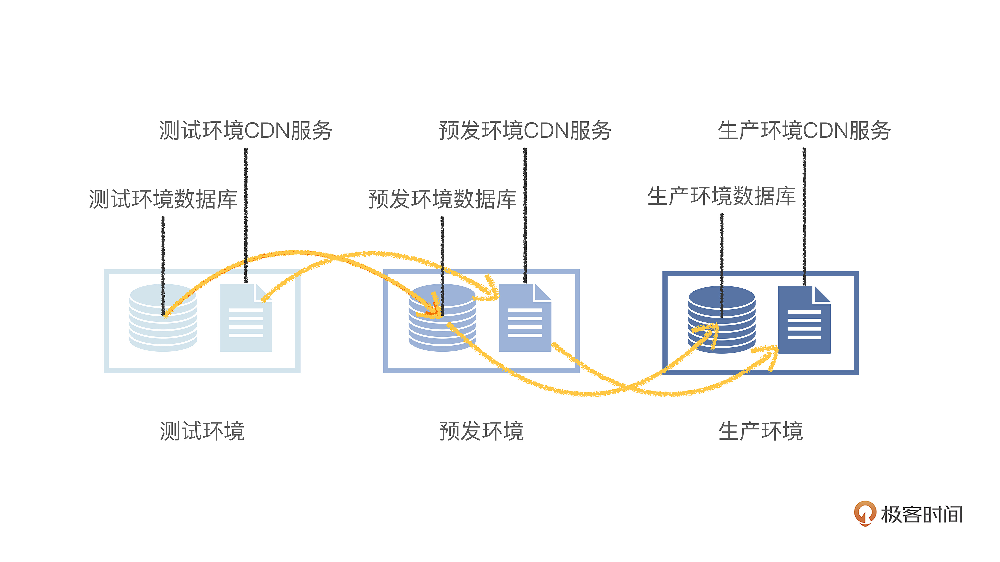
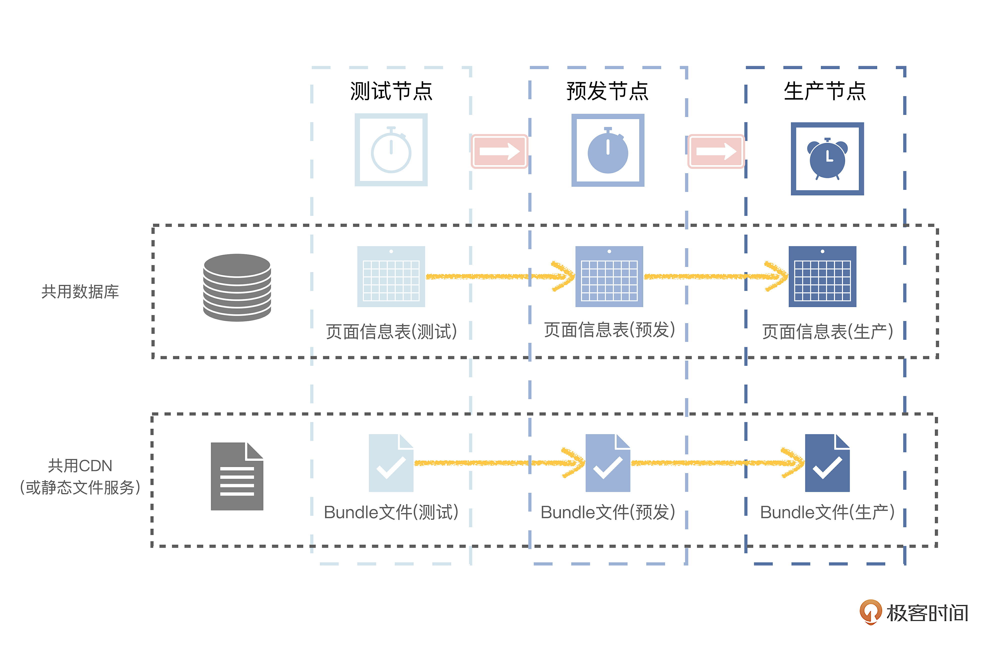

# 27｜后台发布流程：如何实现Vue.js搭建页面的发布流程？
你好，我是杨文坚。

上节课我们学习了“页面编译和运行”，其中，页面编译，就是把“页面搭建”产生的数据，转化编译，产出完整的页面级Bundle文件。结合第一步完成的“页面搭建”功能，通过可视化操作界面，生成完整的页面数据，也就是“页面布局数据”。现在，我们已经有了页面的数据和资源。

我们运营搭建平台的下一步功能实现，就是发布页面了。不过页面的发布不止是简单上线操作，我们需要一个“页面发布流程”，搭建完页面后，把页面发布到生产环境，让客户浏览和使用到页面。

所以，页面发布流程，从技术实现角度看，在页面维度的功能链路中，是承上启下的中间节点，从业务视角看，是维系内部功能和外部功能的纽带。

那么怎么实现Vue.js搭建页面的发布流程呢？我们开始今天的学习。

## 企业级的发布流程究竟是怎样的？

凡是有着严格生产规范的技术企业，把内部开发的产品发布到外部生产环境上，整个过程都有着严格的操作流程。我们运营搭建平台生产出来的页面，要投放到外部生产环境，也需要这类企业级的流程来规范生产操作。

我们就首先了解一下企业级的发布流程。

不同企业对技术产品的发布上线，有不同的发布流程规范，但是，这些发布流程的规范都是大同小异。经过梳理，我把企业级的发布流程抽象出四个基本规范点。

- 有流程节点
- 有多环境隔离
- 发布内容一致性
- 发布操作有迹可循

这四个基础规范点听起来有点抽象，我们逐一了解。

### 1\. 有流程节点

第一点，有流程节点，是指发布流程要有明确的流程节点，而且是面向不同角色的流程节点。一般大厂里，不论是任何技术代码的发布，还是搭建页面的发布，流程基本至少有三个节点，分别是开发测试节点、预发布节点和生产节点。

**开发测试节点** 是面向程序员的，在这个节点中，程序员可以按照需要，修改代码，验证开发后的功能。因为程序员可以不停修改代码和测试验证，所以我们都是叫做“开发测试节点”，或者简称“测试节点”（在课里我们就统称“测试节点”）。

**预发布节点**，面向的角色是项目经理、产品经理等非开发人员，主要是作为功能验收使用。因为是预备发布上产线的节点，一般称为“预发布节点”，或者简称“预发节点”（在课里我们就统称“预发节点”）。到了这个节点，就不能频繁修改代码或者调整功能了，属于临近发布到产线前的最后一步。

**生产节点**，到了这个节点就是代码或者搭建页面上产线，给实际外部客户使用功能了。

### 2.有多环境隔离

第二点，有多环境隔离，就是根据不同流程节点，对应不同环境，并且每个环境都是隔离的，互不干扰。

基于上面提到的三个流程节点，对应的环境就是测试环境、预发环境和生产环境。这里的“环境”概念，可以是独立的服务器、独立的数据库，也可以是独立的代码执行逻辑等等，没有统一的说法，核心是 **要隔离所有功能操作，避免流程之间的干扰**。

### 3\. 发布内容一致性

第三点，发布内容一致性。这是指 **在执行发布流程操作的时候，从一个节点流转到下一个节点，要保证内容传递过去的是一样的**。

举个例子，有个Node.js服务端代码，在测试环境的服务器上验证通过后，要发布到下一个节点，预发环境的服务器，那就要保证流转到预发环境里的代码，和测试环境的代码是一样的。如果从测试环境发布到预发环境，代码不一样，这个发布流程节点的验证就没意义了。

我们课程页面搭建的发布流程操作，搭建完的页面，要从测试环境流转到预发环境，也要保证页面的资源和数据，都原封不动地从测试环境迁移到预发环境。

从两个例子你也可以看出，内容一致性里的“内容”，指的是要发布的内容，可以是代码、数据库的数据，或者是静态资源文件等等。

### 4.发布操作有迹可循

第四点发布操作有迹可循，就是指发布内容到生产环境的任何操作，都需要记录下来，保证有迹可循。这些记录可以为后续发布出问题，提供排查线索或者回滚数据。

回到课程的实际项目中，我们在设计数据库的时候，就设计了“物料快照表”和“页面快照表”，就是为了存储每次发布操作的数据，也就是记录每次发布到生产环境的数据。

了解了发布流程的四个基础规范点，有流程节点、有多环境隔离、发布内容一致性、发布操作有迹可循，我们可以总结出企业中发布流程的作用， **企业发布项目上线，要有流程规范，保证生产的安全和稳定。** 具体就是三方面。

- 方便不同角色执行工作
- 规范不同角色生产操作
- 产线发布操作有迹可循

现在，我们掌握了企业级发布流程的概念，怎么设计搭建平台的发布流程呢？

## 如何设计搭建平台的发布流程？

从企业发布流程的基础规范，你可以看出，规范的核心要素有三个，发布内容、流程节点和节点环境。那么我们对运营搭建平台的发布流程设计，就是围绕着这三个要素来展开设计。

我根据发布流程的这三个要素画了一张图。

**发布内容**，是指搭建平台发布的内容，就是页面的数据和静态资源。这里，静态资源包括页面级的Bundle编译文件，以及物料级的各种模块格式JavaScript文件和CSS文件。

**流程节点**，根据前面企业级最基本流程节点介绍，我们就分成“测试”“预发”和“生产”三个流程节点，来处理页面内容的流转。

**节点环境**，根据流程节点来划分流程环境，可以分成“测试环境”“预发环境”和“生产环境”。然后，基于发布内容的情况，搭建平台发布流程每个环境，需要提供处理页面的“数据”和“静态资源”的内容隔离。

结合流程要素的分析，我们来设计搭建平台完整发布流程的阶段设计图。

我们可以把搭建平台发布流程分成四个执行阶段。

- 准备阶段
- 测试阶段
- 预发阶段
- 生产阶段

第一阶段，准备阶段，“页面搭建”功能模块完成了“页面布局数据的准备”。 **这时候是发布流程的前置阶段，还不算真正进入发布流程。**

以我们课程的代码案例截图为例。第一张截图是“页面搭建”后，点击“提交页面”，准备进入发布流程。

第二张截图是已经进入发布流程页面，准备下一步流程节点操作。

第二阶段，测试阶段，正式进入发布流程。

在这个阶段中，用户可以操作触发“待发布的内容”流转到测试环境， **把准备阶段的数据转到“测试环境”，同时根据测试环境的页面布局数据，编译测试环境的页面Bundle文件**。看课程代码案例截图。

截图是执行了“发布测试环境”后的状态，可以看出，“内容”发布到测试环境后，进行页面的测试环境编译，生成了测试环境下的多种页面预览格式。有了测试环境的预览页面，程序员就可以进行页面功能验证，甚至可以重复多次测试环境。

第三阶段，预发阶段。这个阶段， **用户可以操作“发布内容”，从测试环境流转到预发环境**。这个操作过程可以是纯数据和资源的复制，复制到预发环境中。

从课程代码案例截图可以看出，“发布内容”执行了“提交预发环境”后，也对应生成了在预发环境下的多种页面预览格式。这时候，可以让页面的业务方，也就是产品经理或者项目经理等非开发人员，验证功能。这里，预发环境的预览页面和测试环境的页面，是独立隔离的，互不干扰的。

第四阶段，生产阶段，把在预发环境验证好的“发布内容”，流转到生产环境，也就是 **把页面布局数据和静态资源复制，流转到产线中，让外部用户能访问到页面**。

同时，我们要记录发布快照，把上产线的数据独立存储，以备有需要的时候有迹可循。

运营搭建平台的发布流程，我们就设计好了，接下来就是技术实现发布流程。

## 如何实现多环境的页面验收流程？

综合前面的分析和设计，发布流程都是围绕着“流程节点”和“流程环境”串联流转的。那么我们对应的技术方案，也就是根据这两个要素来进行设计的。不过，在技术视角上，“流程节点”其实就是“流程环境”，根据不同“节点”的特点，隔离发布的内容。所以， **搭建平台发布流程，技术方案的核心，就是对“流程环境”的技术设计。**

流程环境是用来处理发布的内容，所以流程环境是没有明确的技术形式，都是随着“发布内容”的类型变化的。 运营搭建平台的发布内容，就是“页面布局数据”和“页面编译Bundle文件”。

不过在这里，你可能有疑问了，物料的静态资源文件不算在这个发布内容里吗？

其实可以不算的，因为页面的Bundle文件就已经把它编译打包在一起了。如果用AMD或者ESM模块动态渲染，会根据页面布局数据，选择物料对应版本文件，最后动态渲染页面。

所以搭建平台的发布内容，就是“页面布局数据”和“页面Bundle文件”，对应的环境技术就是数据库和CDN。那么实际的技术方案设计，就很清晰了，看设计图。

技术方案，就是基于不同节点环境，把页面数据流转到对应环境的服务器数据库中，把页面静态资源发布到对应环境的CDN服务中。

但是，这样一来，多套环境意味着要准备多套数据库服务和CDN服务，是一笔比较大的开销，技术的花费成本比较大。那么，有没有低成本的多环境方案呢？

答案是有的，我们可以 **基于“同一个环境”做数据和静态资源隔离**。

在低成本方案中，数据的隔离是在同一个数据库中，用多个数据表，隔离同一个数据。同时，在同一个CDN或静态资源服务中，用多个目录，隔离同一个文件。

我们课程的代码案例实现，就是基于低成本的方案来实现的，用本地数据库多个表隔离多个流程节点数据，多个目录隔离多个流程节点的静态资源，具体代码实现，你可以看课程的代码案例。

## 总结

今天我们学习企业中技术生产发布流程的常见方案。虽然不同的企业，发布流程各有差异，但是最基本的发布流程必须至少有三个流程节点。

- 开发测试节点，面向开发者修改代码和测试功能。
- 预发布节点，面向业务方验收功能。
- 生产节点，面向实际外部客户使用功能。

任何有着生产规范的企业，发布流程都是基于这三个流程节点，进行执行或者扩展，以实现安全和稳定的生产规范，毕竟规范就是用来限制行为的，尽量避免操作者错误的生产行为。

我们课程运营搭建平台的发布流程设计，就是基于企业级的三个基础流程节点来实现的。核心的技术实现点，就是根据不同流程节点，定制对应的流程环境，具体考虑两点。

- 根据发布内容的特性选择具体技术。例如，内容特性是数据，可以选择数据库技术，是静态资源，可以选择CDN技术。
- 根据开销成本，选择高性价比的技术使用方式。例如预算成本低，就选择同数据库多个表来隔离多个流程节点的数据。

## 思考题

今天我们的流程设计是线性的，测试、预发、生产三个流程节点操作是串行。那么有没有并行多环境的操作，例如同时多个测试环境、多个预发环境的流程设计？

期待在留言区看到你的想法。

通过今天的学习，希望你能深刻理解企业级的发布生产流程，感受到企业中的安全生产规范，并且能举一反三，因地制宜设计和实现属于自己的项目的发布流程。我们下节课见。

### [完整的代码在这里](https://github.com/FE-star/vue3-course/tree/main/chapter/27-28)