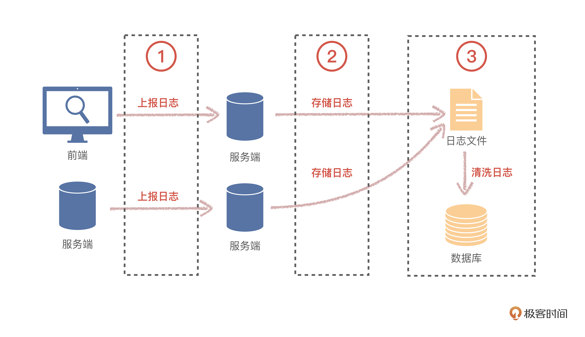
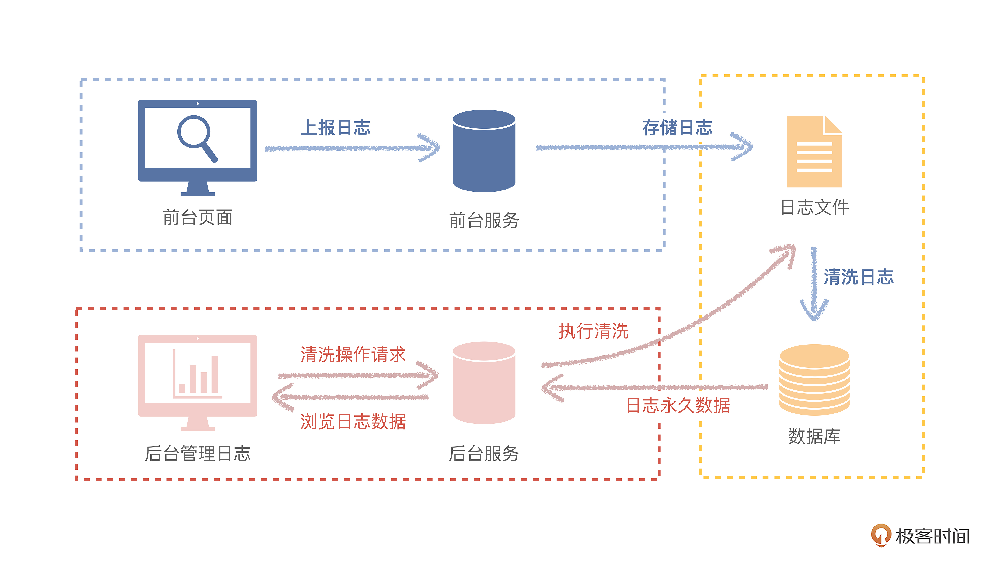
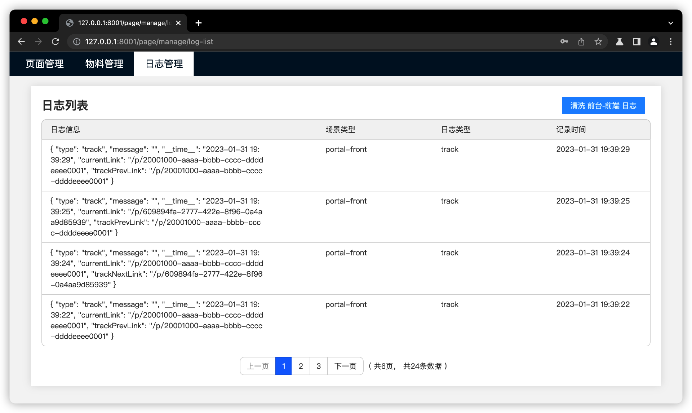
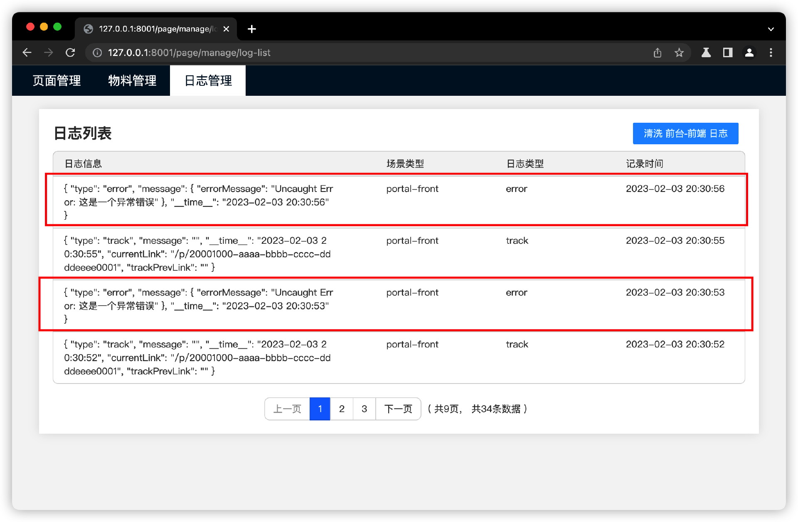
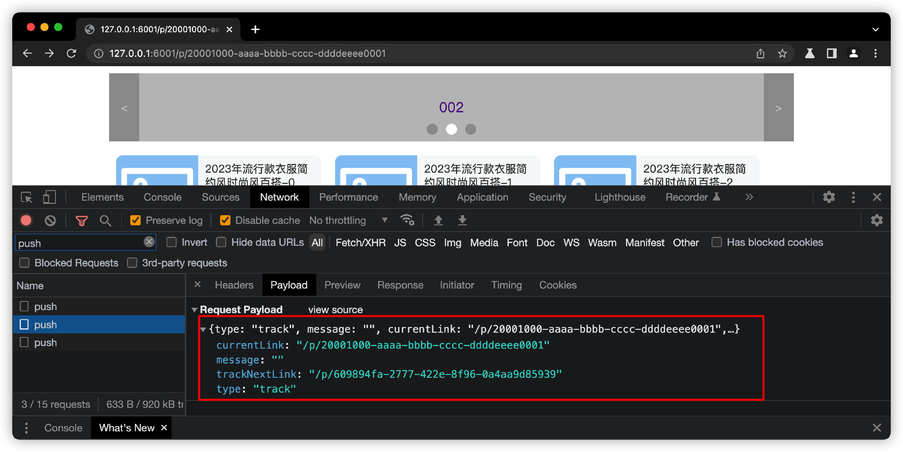

# 31｜前台页面的日志监控：如何进行页面实时监控与问题定位？
你好，我是杨文坚。

上节课我们学习了实战型的页面性能优化，分析了做性能优化的两种思路，前置优化、后置优化，以及如何根据客户反馈的性能问题，借助工具定位技术原因，最终设计具体方案，优化前台页面的性能。

今天我们进入实战型的平台功能扩展，主要围绕日志操作来扩展平台的页面监控功能。

如果你没接触过日志相关的功能开发，可能会对日志是什么、为什么需要日志有疑问，我们先解决这两个问题。

## 日志是什么？

在计算机领域中，程序在运行过程产生的异常错误、运行状态和操作行为等数据，就可以称为日志。不过，日志只是一种技术概念，没有明确规定的技术实现，只要能记录和存储数据的技术操作，都可以称为日志技术。

日志数据在记录和存储后，不一定会永久存储。这是因为日志是记录程序运行过程中的状态数据，只要程序还在运行，就会源源不断产生新日志数据，不断占用存储空间。而且，日志数据无论用什么技术方式实现，都会占用存储空间，只是不同技术占用的存储空间有差异。

所以，为了避免日志数据无限产生，占用大量存储空间，日志数据一般会执行滚动式覆盖，或者系统设置定时任务，自动清理日志数据，或者人工手动定期清理日志。

虽然存储的日志数据定期清除释放空间，但是有些日志数据需要长时间被使用，例如页面流量的日志数据，用来分析页面从哪跳转过来，又会跳转到哪去。所以，日志不能直接被覆盖或者删除，比较重要的日志要在清除前转成长期数据，比如转移到数据库中。

总的来说，日志的核心功能逻辑，我们可以归纳成三点。

- 上报日志
- 存储日志
- 清洗日志



那我们课程的项目为什么需要日志呢？

## 为什么需要日志？

从日志的特点可以看出， **日志功能的本质作用是记录程序运行时候的状态数据**，可以是技术的状态，可以是业务逻辑的状态，没有明确的规范限制。

有了程序运行时候的状态数据，我们就能开展很多扩展工作，通常可以归纳成三类。

- 排查问题
- 问题预警
- 数据挖掘

### 1\. 排查问题

排查问题，指的是可以基于日志数据来辅助排查问题，尤其是一些偶现且无规律的问题，比如员工用户在搭建页面的时候，出现报错导致生成页面失败，但是重试几下成功了。 **这个问题的棘手点，就是搭建页面报错情况出现很偶然且无规律，同时需要多次重试才能成功。**

面对这类问题，我们作为程序员开发者，一般很难准确还原问题场景，也很难从这些问题表象看出原因。这时候，能帮助排查问题的有效途径，就是查看问题发生时，记录的程序状态数据。

如果在问题发生时，能对前端和服务端的异常错误进行日志记录，我们就能在问题被反馈的时候，根据程序当时记录的日志数据，找到问题发生时前端和服务端的状态信息，甚至是报错信息，尽量还原出问题场景。

如果日志操作逻辑，记录的问题信息不全面，我们可以补足对应场景的日志记录操作，等待问题的下次偶现，得到更全面的信息，辅助问题的再次排查。

### 2\. 问题预警

第二类工作内容，问题预警，就是可以定时地清洗归纳日志数据，分析程序是否存在问题爆发的可能性，并且做出预警。

假设我们发布了搭建的页面给外部客户使用，如果页面出现问题，一开始只有少数客户使用功能受到影响，后来越来越多客户使用不了页面，就可能演变成生产故障。 **这类问题场景的特点就是“已上产线的页面”“客户功能不可用”和“影响面从小变大”。**

这类故障在企业中很难避免，因为有些问题场景出现的逻辑比较隐蔽，程序员自测很难发现这个问题的逻辑，只有大量用户使用，才有一点概率让部分用户进入错误逻辑，导致功能不可用。

对于这类隐蔽的问题，我们可以监控问题的变化趋势，快速进行页面回滚操作，避免问题扩大变成故障。这时候，问题的“监控操作”，就是基于日志数据来进行“问题预警”。

具体实现步骤都大同小异，首先，实时发现和记录前端和服务端报错日志数据，然后做定时任务清洗数据，把错误数据归纳落库；如果定时程序判断当前时间点的错误量上升，就用邮件或其它通知形式告知程序员，让程序员来判断预警是否为真实问题；如果是真实问题，就可以及时做好解决方案，比如回滚页面，避免问题大量爆发。

### 3\. 数据挖掘

第三类工作内容，数据挖掘，分析日志数据的内容，提取有业务或者技术价值的直接内容或间接内容。

企业常见的挖掘工作就是分析日志中的客户或者用户的行为数据，归纳用户行为，并推测有哪些可挖掘的信息点。比如，挖掘出用户的兴趣喜好，作为推荐功能的依据；分析每张搭建出来的页面，流量来源和去向是哪些页面，梳理流量转化漏斗。

比如，业务方想知道运营搭建平台发布的某个页面，是从哪些上游页面进入的，会跳到哪些下游的页面。如果能有日志数据，记录每次进入搭建页面的上游页面信息，以及，每次离开页面前往的下游页面信息，梳理这两个信息，我们就可以知道搭建页面的流量来源和去向。

日志的三点核心功能逻辑和三点作用，我们就复习好了，下面就进入实操环节。

我们的课程案例主要是站在客户视角，围绕“前台页面”实现“监控页面的异常”和“跟踪页面流量”，功能实现也会遵循刚才归纳的日志功能链路，上报、存储和清洗日志。所以，功能实现的第一件事就是要通过上报和存储，收集日志数据，具体如何实现呢？

## 如何实现上报和存储日志？

日志的收集，首先要有上报操作。

“上报日志”主要指的是用代码来收集需要记录的日志，在我们的项目中可以分成“前端场景”和“服务端场景”，每个场景里的具体上报操作类型，可以分成“通用数据上报”和“业务数据上报”。

### 1\. 前端场景

前端场景里， **通用数据上报，主要基于全局事件的监听**。例如监听页面全局错误事件，一旦页面发生异常错误，就会被监听的方法捕获，然后我们用HTTP请求，把错误数据传递给服务端进行记录。

比如课程项目代码案例中，上报前台页面错误日志的代码。

```typescript
// packages/portal-server/src/public/static/page-helper.js
window.addEventListener('error', (err) => {
  // 上报异常日志
  fetch('/api/log/push', {
    body: JSON.stringify({
      type: 'error',
      message: { errorMessage: err.message }
    }),
    headers: {
      'content-type': 'application/json'
    },
    method: 'POST'
  });
});

```

前端场景里， **业务数据上报，主要是要根据业务的需求，编写特定的代码，收集特定的业务逻辑数据，最后也是用代码来触发上报日志。**

课程项目收集搭建页面流量来源和去向，就是一种业务需要的数据，需要编写特定的代码逻辑，收集数据来上报。比如，课程项目代码案例中，跟踪前台页面流量的上报日志代码。

```typescript
// packages/portal-server/src/public/static/page-helper.js
window.addEventListener('DOMContentLoaded', () => {
  // 进入页面时候，上报日志，记录“上游页面链接”
  fetch('/api/log/push', {
    body: JSON.stringify({
      type: 'track',
      message: '',
      currentLink: window.location.href,
      trackPrevLink: document.referrer, // 上游页面链接
    }),
    // ...
  });

  const body = document.querySelector('body');
  // 监听页面所有点击前的操作
  body.addEventListener('click', (event) => {
    let currentTarget = event.target;
    // 检查点击DOM是否为<a>标签
    while (currentTarget.parentElement) {
      // 判断是否为<a>标签，且存在跳转链接
      if (currentTarget.nodeName === 'A') {
        // 要跳转的下游页面链接
        const url = currentTarget.getAttribute('href');
        if (url) {
          // 上报日志，记录“下游页面链接”
          fetch('/api/log/push', {
            body: JSON.stringify({
              type: 'track',
              message: '',
              currentLink: window.location.href,
              trackNextLink: url,
            }),
            // ...
          });
          // 拦截<a>标签默认点击跳转操作
          event.preventDefault();
          // 延时人工代码触发跳转到下游页面
          // 为了保证上报日志请求能发送成功
          setTimeout(() => {
            window.location.href = url;
          }, 200);
          break;
        }
      }
      currentTarget = currentTarget.parentElement;
    }
  });
});

```

这段代码分成两个部分，上报页面流量来源日志，监听和收集页面流量去向日志。

- 第一步，等待加载页面成功，收集上游页面的链接，上报流量来源的日志数据；
- 第二步，监听页面所有 `<a>` 标签的点击事件，一旦 `<a>` 标签被点击，就判断是否有href属性内容，也就是要跳转的下游页面的链接；如果准备跳转，就上报要跳转的目标页面链接，作为流量去向的日志。

这里你可能会有疑问， **只监听** `<a>` **标签收集上报页面跳转是不是不够全面？如果用“location.href”或者“window.open”来强制跳转，不就监听不到流量去向了？**

好问题，的确存在这类遗漏技术分支，但是这个业务操作属于业务开发规范，如果开发规范约定用 `<a>` 标签统一处理页面链接跳转，可以统一上报流量去向的日志内容。

同时，我们用“document.referrer” 收集上游页面链接，严格讲，也不全面，因为有一些浏览器考虑到用户隐私权限问题，会限制“document.referrer”的使用或记录上游页面。如果要更全面地记录上游页面链接，我们也可以约定技术开发规范。比如页面跳转一律带上当前页面的URL或者标识的数据，传递到下一个页面，让下游页面知道页面的流量来源，方便统一上报日志。

所以，这些都是根据不同业务需求的严谨度，进行技术开发层面的约定规范。

### 2\. 服务端场景

服务端场景里，日志收集和上报比较简单。无论是通用数据上报，还是业务数据上报，常见技术操作，都是直接在对应逻辑代码中，编写上报日志代码。

课程案例代码在monorepo的项目里，创建了一个子项目mock-logger，来模拟统一的日志读写操作。如果要在服务端上报日志，可以这样使用代码：

```typescript
import { writePortalFrontLog } from '@my/mock-logger';

// 在需要的上报日志的服务端逻辑中
// 进行日志上报
writePortalFrontLog(logData);

```

这段代码，就是基于Node.js的文件系统API，把日志数据写本地磁盘文件里（更详细的代码实现，可以看课程的代码案例）。

### 日志存储

完成了日志数据的上报，下一步就是日志数据的存储操作，也就是“存储日志”。

开头我们讲过，日志功能没有具体的技术实现规范，只要能收集和存储日志数据就行。目前， **企业常见记录日志的技术实现都是在服务器里，就近写在本地磁盘文件中。**

这里你可能有疑问，为什么不把日志数据直接写在数据库里呢？其实，理论上，直接把日志记录到数据库里也没问题。但是，记录日志是非常高频的操作，如果频繁调用数据库服务操作，插入日志数据，数据库会承载非常大的服务连接压力。

把日志数据直接写在服务器的磁盘文件里，也有讲究。

存储日志是高频操作，必然会产生大量的数据，如果都放在一个日志文件里，数据的读取和查询会很不方便，所以， **一般写数据到日志文件时，我们会按约定的文件格式独立记录**。例如按日期格式来创建每天的日志文件，每个日志文件都只记录当天的日志数据（课程的记录数据文件格式，就是按每天的维度来独立记录）。

由于日志文件占用服务器磁盘空间，而且日志数据量会频繁增加，我们需要定期清除日志，腾出磁盘空间来记录新的日志数据。如果要利用日志数据，不想让日志数据被直接删除，就需要对数据进行清洗，保留有需要的日志数。

### 如何清洗日志数据？

不过，“清洗日志”里的“清洗”不是专业技术术语，也没有特定的相关技术概念，这是我们通俗的描述。“清洗日志”的具体技术内容，通常是读取日志文件里的数据，然后过滤出有需要的内容，存储到数据库里，长期保存。

课程的案例中，是对页面流量日志数据进行清洗，然后存到数据库的日志表里。具体的清洗逻辑就是，先判断流量日志是否为有效数据，如果是，就过滤提取出来，批量存储到数据库的日志表里，最后删除掉已清洗过的日志文件，腾出磁盘空间。

现在有了日志的完整功能逻辑，接下来就来完整实现本节课的项目两个日志监控的功能点。第一个功能就是监控和记录页面异常日志。

## 如何监控前端页面的错误异常？

完整的日志功能只是记录和清洗日志是不够的，还需要有查找日志详情的能力。

所以，我们监控页面异常的技术方案，要补充查找能力。



看方案图，分成四个实现步骤。

- 第一步，在前台页面中，监听页面统一的错误异常事件。
- 第二步，上报和存储日志，把日志数据通过HTTP方式传递到服务端，写在磁盘文件中。
- 第三步，清洗日志，提取需要长期存储的日志数据，转移到数据库中。
- 第四步，在后台日志管理页面中，提供永久日志数据查询操作。

最后实现效果，看截图。



我在前台页面上触发一个错误，就会发起一个日志请求。


接着，在后台日志管理界面清洗日志，然后查询数据库的永久日志数据，看看近期页面有哪些前端页面报错日志。



通过日志功能，监控页面错误异常，我们就实现完成了，接下来看第二个功能点，通过日志功能，监控页面流量的来源和去向。

## 如何监控页面流量的来源和去向？

要完整地实现跟踪页面流量功能，我们还是先画功能步骤图。


实现步骤可以归纳成四步。

- 第一步，进入前台页面时候，上报和存储上游页面数据。
- 第二步，要跳出前台页面的时候，上报和存储即将去往的下游页面数据。
- 第三步，清洗日志，把有效日志数据批量存入数据库。
- 第四步，在后台页面管理中，提供根据页面来查询日志上下游流量数据。

看最后实现效果图。


我先搭建一个页面，进入页面或离开页面的时候，发起日志上报请求。



最后进行页面流量的数据挖掘，也就是分析数据库里的日志数据（更具体的代码实现，你可以查看课程的代码案例）。

## 总结

我们围绕“日志”这个技术概念，学习了常见日志功能的技术实现，以及常规Node.js全栈项目的日志方案设计。

日志技术是一种技术概念，没有限定技术的实现方式，只要能实现记录和存储日志数据，就可以看做日志功能的实现技术。

在实际项目中，日志功能的常见逻辑链路有三点。

- 上报日志，根据场景环境特点，选择记录方式。比如前端的浏览器环境，就可以选择HTTP请求来记录日志到服务端中。
- 存储日志，根据项目业务情况，选择存储日志数据。比如课程的运营搭建平台的服务端，避免频繁操作数据库，选择把日志数据存在临时文件中。但是业务需要看到每个搭建页面的上下游流量情况，就需要在清洗日志的时候，处理临时日志文件，把数据转移到长期存储的数据库中。
- 清洗日志，这个过程是可选的，按照技术和业务的需求，过滤出需要长期存储的数据，转移存储到数据库中，方便后续查询和使用。

## 思考题

我们学习了页面级别的跳转链路日志跟踪，那要实现页面某个模块曝光、点击或其他操作的行为跟踪定位，如何设计这个日志收集功能？

欢迎在留言区参与讨论。在掌握日志技术的同时，也希望课程案例能给你带来新的启发，跳出单纯实现技术功能的工作模式，思考如何用日志技术，辅助跟踪定位问题原因、分析业务价值。

我们下节课见。

### [完整的代码在这里](https://github.com/FE-star/vue3-course/tree/main/chapter/31-32)