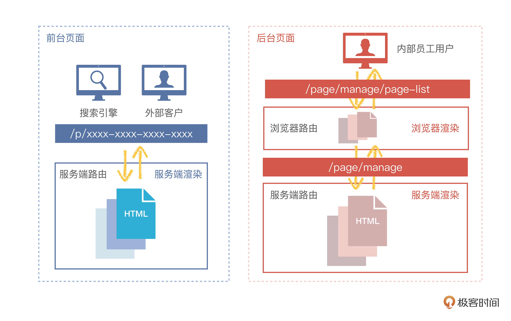
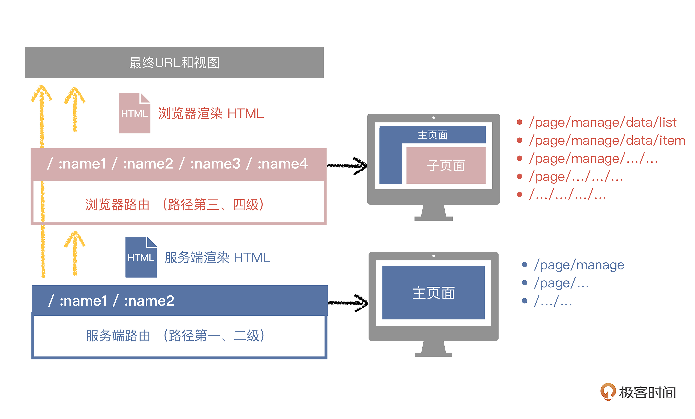
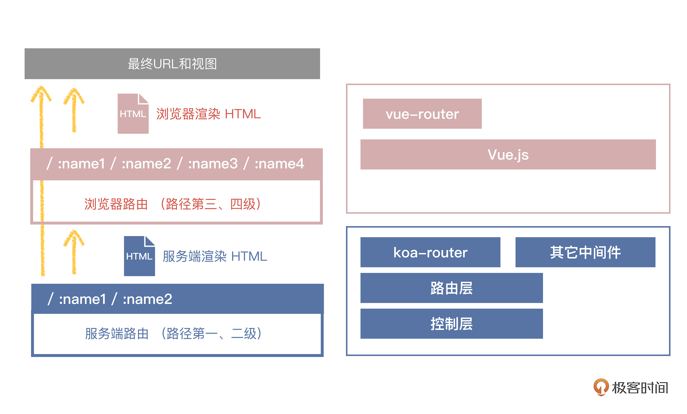
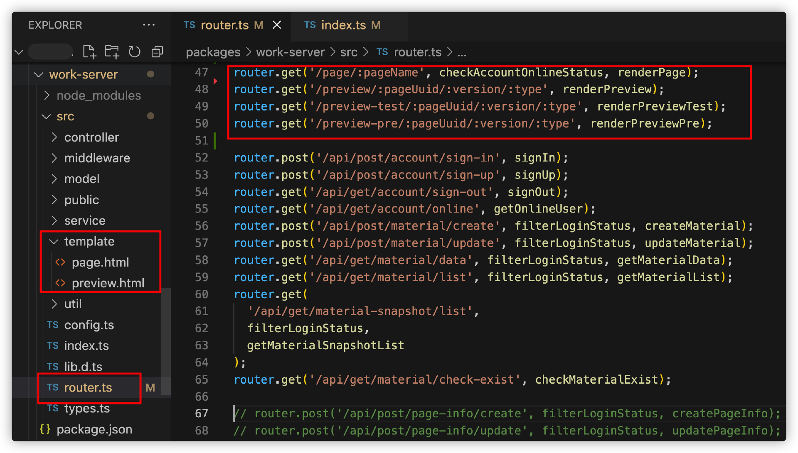
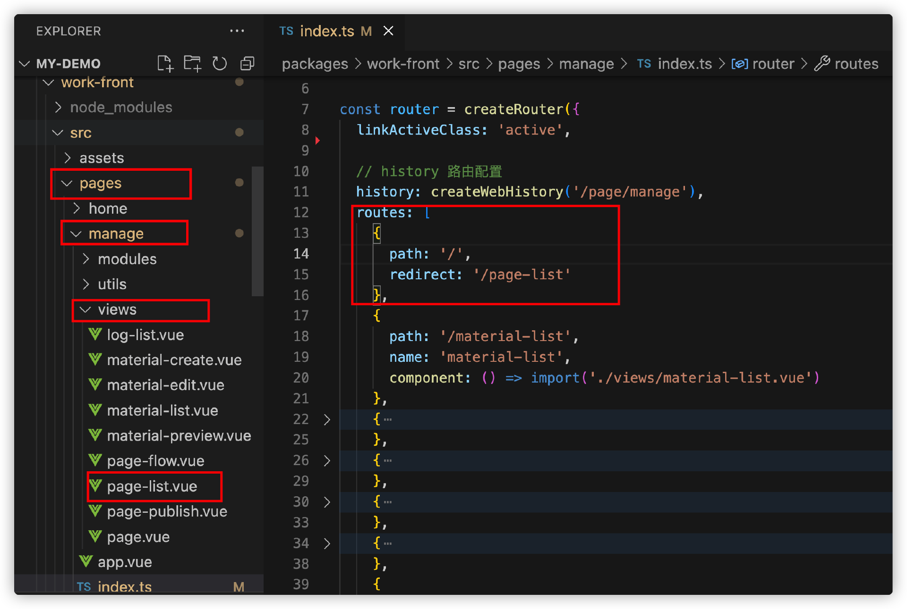

# 33｜页面功能扩展：如何对Vue.js全栈项目做优雅扩展？
你好，我是杨文坚。

回顾课程全栈项目，我们的开发工作主要是实现搭建平台的页面功能，围绕着Vue.js，实现物料管理、布局搭建等页面功能开发。

即使Vue.js换成React.js，要实现运营搭建平台，也要开发类似的页面功能，这也是为什么前端程序员在搭建平台这类项目中，体现出了比较重要的价值。如果搭建平台需要进一步扩展功能，我们前端程序员，自然而然地也会在项目中继续占据主导地位。

从今天开始，我们就进入增强篇，学习运营搭建平台的功能扩展，主要会围绕页面维度的功能展开。

不过，你可能会有疑问，目前运营搭建平台实现的功能，基本能满足搭建操作需要了，为什么还要进行功能扩展呢？

## 为什么平台需要扩展功能

虽然运营搭建平台已经实现了核心功能，能满足大部分搭建需求，但是原有平台功能不是一成不变的。平台能长期运转，需要不停地维护迭代和功能升级。

**一般，这种平台扩展的功能是五花八门的，很多情况下，我们都是根据实际使用时遇到的问题，扩展对应的功能来解决问题。** 例如，在课程运营搭建平台中，如果后台用户密码泄露了，我们就要添加功能给企业内部用户修改密码；如果后台用户忘记密码了，我们就要解决用户忘记密码的问题，扩展出用户重置密码页。

所以，完成核心功能，并不意味着项目平台的开发就结束了，我们需要持续迭代扩展功能，来应对使用时遇到的问题，或者是业务方提出的需求。

到这里，你可能会有疑问，对于“功能扩展”这一个任务，不就是日常开发时直接新增功能代码吗？我们在之前的课程里也是这么进行的，有必要单独学习“功能扩展”的内容吗？

我们还是看刚才的例子。

- “修改密码”的扩展功能， 需要在用户已经登录的状态下进行，可以直接扩展到已有登录态的单页面应用里，扩展成子页面实现功能。
- “找回密码”的扩展功能，重置密码页是不需要登录状态的，作为独立的一张前端页面，这时候就需要用多页面的形式进行扩展。

你会发现，对于这两个很小的用户密码的扩展功能，技术原理说白了就是修改数据库里的密码数据，但是 **放到已有平台里做功能实现，就要顾及到平台已有的业务和技术**，例如平台已有登录态逻辑、多页面单页面应用的技术区分等等。

所以，你的平台如果是从0到1重新开始写代码，没那么多顾虑。但是我们要在已有的平台上扩展功能，比如例子中的页面功能扩展内容，涉及很多业务和技术环节，就需要详细分析如何开展全栈项目的“功能扩展”。

## 如何开展功能页面扩展工作

好，既然要扩展功能页面，按照解决问题最直接的思路，就是要找到所需要的浏览器路由，或者服务端的配置代码，添加新的页面内容，然后开展功能开发工作。

不过，用最直接的思路，我们虽然能快速完成扩展工作，短期内问题不大，但是随着扩展功能的日积月累，无序增加页面越来越多，问题就会逐渐显现出来。比如现在要做安全监控，对所有页面注入安全监控脚本的 `<script>` 标签，如何处理，才能保证所有页面都能加入脚本？

还有更棘手的，不同程序员的开发习惯不一样，可能导致一些隐藏的错误风险。比如不同程序员对页面的URL路径定义规范不统一，不考虑大小写敏感的场景，可能导致页面内容渲染冲突。

**总的来说，这种扩展页面的方式，核心的问题就是没有统一的规范**。一旦没有可遵守的规范，程序员都会按照自己习惯的方式，直接开发功能，这样就会逐渐积累项目的不稳定因素。

不过，你可能会质疑“规范的作用”，觉得即使有规范，有些程序员不一定会遵守规范，甚至规范的制定者也不一定会遵守。

有质疑很正常，规范需要有“约束力”才能发挥作用。这就不是技术问题了，而是一个管理层面的问题。 **只要规范能达成共识，对于项目的规范遵守内容，我们就需要“规范的约束力”来运作。**

这个“约束力”往往来自于“管理者”或“管理权限”，具体落地方式有很多种。比如，可以通过和上级主管沟通，把规范纳入绩效考核范围；可以限制项目代码必须Code Review；可以限制项目Git仓库的合并代码权限，让开发无权合并自己的开发分支，需要他人检查后才能合并等等。

现在解决了“规范”相关的“约束力”问题，剩下就是“规范”本身，如何设计项目的页面扩展规范呢？

## 如何设计搭建平台的页面扩展规范

首先要说明一下，这里我们讨论的扩展规范，是业务和技术结合的扩展规范，而不是单纯的“技术规范”（课程的Vue.js全栈项目页面功能扩展，就是围绕着“扩展规范”来进行的）。

“扩展规范”，需要结合搭建平台的业务和技术的内容特点，那我们设计扩展规范的第一步就是梳理平台特点。

### 业务层面分析

先从业务内容特点开始。梳理业务，一般最便捷的方式，就是先找个维度切入，然后展开梳理。

运营搭建平台可以从受众维度切入。我们根据受众视角，分成了前台页面和后台页面。



前台页面，是搭建完成的页面，提供给外部客户使用，每个页面都是独立的URL路径，而且必须支持SEO，方便搜索引擎爬取数据。

所以， **前台页面的扩展，必须是独立的服务端路由渲染，并且需要支持SSR，也就是服务端渲染页面HTML**。

后台页面，很多是功能聚合型的操作，一个功能链路需要切换多张页面。但是，基于多页面实现，可能存在切换功能加载页面体验不友好的问题，所以，建议用单页面应用来处理功能聚合型，也就是说，后台页面，需要支持服务端路由和浏览器路由的结合渲染。

而且后台页面，是操作搭建功能的页面，提供给企业内部员工使用，员工在使用后台功能时候，必须是登录状态下才能使用。所以，后台页面扩展也必须支持有无登录态的判断处理。

汇总一下， **后台页面的扩展，必须能优雅配置是否需要登录态、能优雅选择是否服务端渲染，以及能优雅选择多页面或者单页面应用方式**。

### 技术层面分析

业务层面分析完成，接下来我们进入技术层面的分析。技术内容的梳理不是凭空想象出来的，需要根据前面的业务特点，分析所需要的技术点。

我们照例还是先画前台页面和后台页面的技术分析图。


然后我们根据业务特点和技术分析，归纳所需要的技术点。

- 前端页面渲染技术点：单页面应用、浏览器路由。
- 服务端页面渲染技术点：服务端路由、用户权限判断、处理页面HTML。

我们进一步对业务和技术内容分层。

- 前端层面：浏览器多级路由层、多级子页面管理层。
- 服务端层面：服务端多级路由层、路由权限状态层、服务端渲染页面层。

对于服务端层面的多级服务端路由来说，我们可以定义多级路由。但是，路由不能随便定义，要确定好服务端多级路由规范。

```shell
## 一级页面路由
/page

## 二级页面路由
/page/manage

## 三级页面路由
/page/manage/material

## 四级页面路由
/page/manage/material/item

```

在多级路由例子里，我们可以从“/page”这一级路由开始，扩展出普通页面，确保普通页面都是基于 “/page” 这个路径前缀来扩展的，在普通页面视角上，避免出现路由注册的冲突。

不过，有多级路由，是不是意味着服务都可以不断扩展路由层级呢？

并不是。路由这个层面的设计要尽量简约，服务端扩展到第二级路径就好，往后层级保留给前端的浏览器路由使用。

```shell
## 服务端路由
## 一级页面路由 (服务端)
/page

## 二级页面路由 (服务端)
/page/manage

## 前端浏览器路由
## 三级页面路由 (前端)
/page/manage/material

## 四级页面路由 (前端)
/page/manage/material/item

```

从课程项目服务端和前端页面路由的综合规范，我们可以看出，一到二级的路由渲染页面是服务端路由控制的，二级往后的多级路由是浏览器路由控制的，这也区分了服务端渲染和浏览器前端渲染的路径范围，避免页面路由无规则扩展。具体规范可以参考这张图。



这样约定之后，我们的项目就能让开发者在扩展页面的时候，根据需求的不同特性，直接选择合适的路由来扩展，也能在项目交接的时候，让新手开发者从页面URL的路径里，快速理解页面需要选择什么技术。

综合约定了页面的路由扩展规范，接下来就是路由层往后的扩展，服务端需要的是权限控制，基于Koa.js的Web服务，我们可以利用koa-router路由中间件，做统一控制处理。

```typescript
// packages/work-server/src/router.ts

import Router from '@koa/router';
const router = new Router();
// 其它代码 ...

// checkAccountOnlineStatus 方法是检查账号是否有在线登录态
// renderPage 方法是渲染页面
router.get('/page/:pageName', checkAccountOnlineStatus, renderPage);

// 只有checkAccountOnlineStatus验证状态通过后，
// 才能进入renderPage渲染页面

// 其它代码 ...

```

完成了路由和权限的规范设计，剩下的就是页面内容的扩展，这个在服务端层面和前端层面比较类似。

- 对于服务端来说，比较简单，就是HTML页面字符串的处理，我们可以基于Vue.js的CommonJS模块进行渲染，或者直接拼接字符串输出。
- 对于前端来说，要考虑基于vue-router的子路由，也就是前端层面多级路由扩展。我们可以根据业务的归属层次，进行浏览器端的子路由注册，以及子路由背后对应的Vue.js组件的渲染。



现在，有了扩展规范，要把规范落实到实际开发中，我们还需要做技术能力和规范的整合，方便不同开发同学按照规范，快速开发扩展代码。在课程里，运营搭建平台页面扩展的技术整合基础，我们就统一叫“底座”，那么这个技术底座怎么设计呢？

## 如何实现项目页面扩展的技术底座

回顾课程全栈项目的代码结构，如果你细心的话就会发现，我们课程搭建平台一开始的项目代码就是一个天然的技术底座。

以后台服务端的代码结构为例。服务端底座层面，以路由作为切入点，扩展一个新的路径前缀，就支持对应的路由注册。接着，再扩展新的服务端渲染HTML模板，以及控制层渲染方法。



这张截图，就展示了后台预览搭建结果渲染页面，扩展了三种不同环境的预览页面路径以及服务端渲染方法。

按照这个技术底座思路，之后，服务端扩展页面就从路由、渲染模板和控制层渲染方法这三个环节来扩展处理。

我们课程全栈项目的前端代码，也是从技术底座的视角来设计的。



这张截图是后台的前端子项目代码结构，你可以直接理解成单页面应用扩展的前端技术底座。扩展单页面应用是按照目录结构进行的，可以直接对比路由的多级路径，方便开发者扩展页面操作（更多技术底座的代码内容，可以查看课程的完整代码案例）。

课程里的页面功能扩展，核心是围绕“路由”这一线索，进行规范设计和技术底座实现的。如果你用过“微前端”相关的技术，可能会有疑问，同样是以“路由”为线索来扩展和聚合页面功能，为什么我们不选择微前端，而是自己独立设计和实现页面扩展呢？

## 课程的页面扩展和微前端有什么区别

前端页面的设计和实现内容，整个页面扩展过程，跟“微前端”的技术场景确实很像。其实，课程前端页面扩展，单纯从扩展页面的技术视角上看，你也可以理解成一种“微前端”的形式。

但是，跟实际的微前端技术还是有很大区别的，主要表现是解决问题的场景不同。

**在企业项目开发中， 微前端侧重解决多技术体系页面的聚合问题**。我们工作中经常遇到类似的需求，要把不同前端技术体系（例如Vue.js和React.js）的页面整合成一个平台，或者把不同前端技术模块整合成一个页面。在这个过程里，我们必须选择一种技术作为“技术底座”的主要技术，然后扩展其它技术体系页面，这也是一种扩展页面功能的技术规范。

但是， **课程的页面扩展内容，要解决的问题是对已有项目，如何有规范地扩展页面功能**，而且，我们的课程是基于Vue.js的全栈项目进行页面扩展，没有涉及多种页面技术体系的聚合，所以没必要过度设计使用微前端。

总的来说，要解决业务问题或需求，我们不能单纯靠堆技术框架完成功能，而是要根据项目现状，分析特点，设计合适的技术规范，实现功能。同时，还要避免滥用技术框架，避免出现过度技术设计的情况，导致维护成本剧增。

## 总结

今天我们学习了如何实现任何业务或者技术的功能扩展，梳理一下思路，首先要找到分析的“切入视角”，然后找到“线索”来设计扩展规范，最后围绕规范，实现“技术底座”，方便提高日后功能扩展的效率

以搭建平台的前端页面扩展为例，首先，我们从业务视角归纳了前台和后台的页面特征，同时结合多页面/单页面应用、服务端/浏览器路由等技术概念进行整合设计；然后，围绕着“路由”这个线索，设计扩展规范；最后根据前后端业务和技术的扩展规范，实现了项目的“技术底座”。

对于页面功能扩展，我们以“路由”为核心线索，自己独立进行的规范设计和技术底座实现，不涉及多种页面技术体系的聚合问题，也就没有选择微前端方式。

总的来说， **没有万能通用的扩展方式，不同业务有不同需求，不同技术有不同特性，很难整合设计出“全兼容扩展”的技术框架**。实际工作中，我们都要“因地制宜”设计项目的扩展能力，具体来讲，就是要从技术视角分析有哪些页面扩展类型，再从业务视角分析需要哪种业务逻辑页面，最后整合技术和业务的特征。

## 思考题

如果扩展成兼容Java服务端提供的页面，这些页面也包括了多页面和单页面应用形式，要如何进行底座设计？

期待在留言区看到你的思考，我们下节课见。

### [完整的代码在这里](https://github.com/FE-star/vue3-course/tree/main/chapter/33-34)