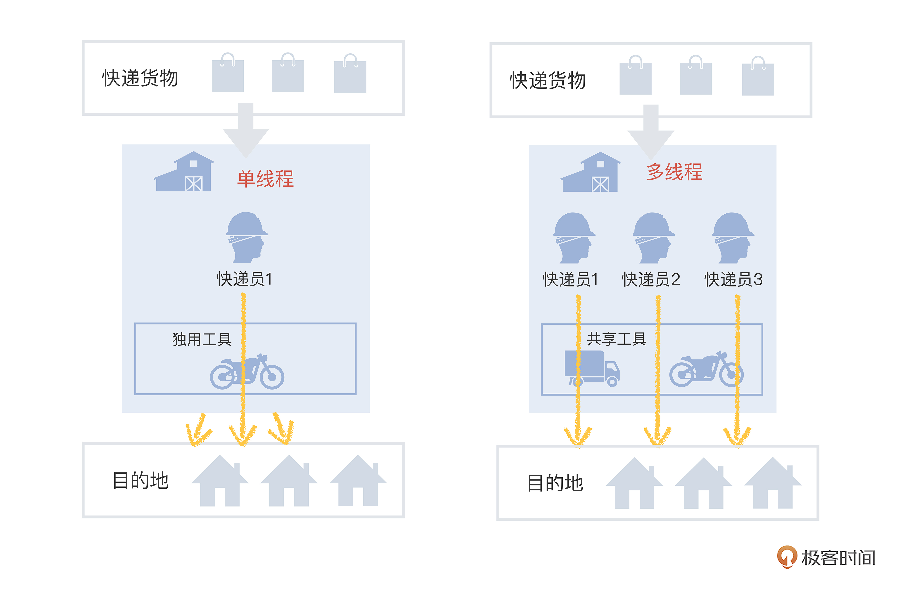
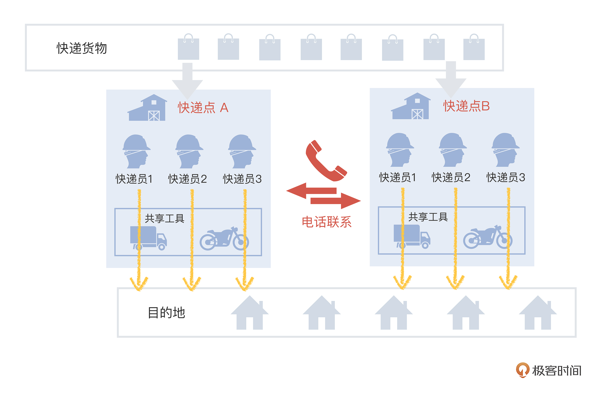
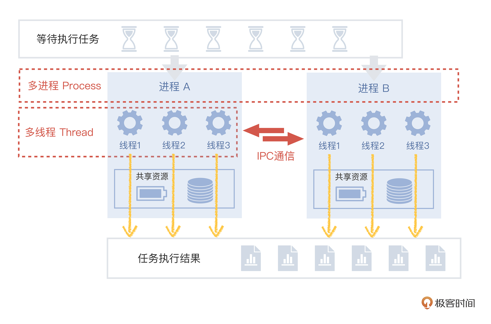
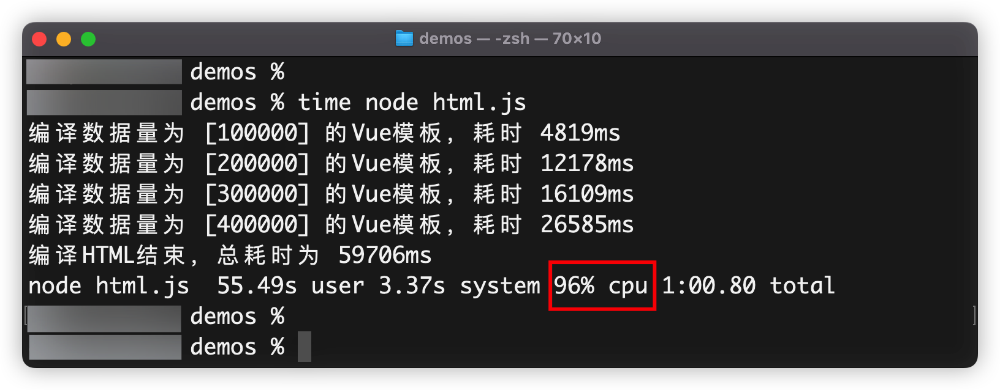
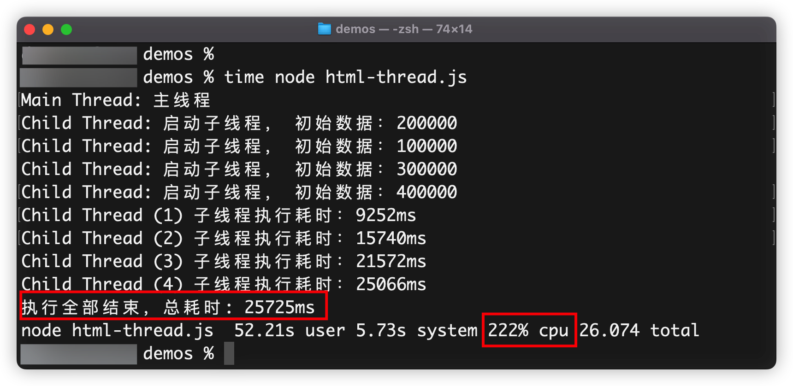

# 35｜多进程部署：如何最大限度利用服务器资源运行Node.js服务？
你好，我是杨文坚。

上节课，我们基于服务端的纵向和横向切面，把Node.js服务化整为零，分解成了服务的各个最小颗粒度模块；然后根据这些模块逻辑，设计出两种方向切面的扩展规范；最后根据扩展规范设计和服务端结构分析，我们详细展示了服务端“技术底座”，分析了如何根据技术框架优势，更优雅地扩展功能。

到现在，我们已经实现了搭建功能，也做好功能扩展工作，那服务端开发方面的工作，是否能告一段落呢？

答案是否定的。还记得吗，之前我们在阶段性完成前端页面的开发工作后，还用一节课的时间，学习了如何优化搭建平台的前端性能。服务端的开发工作也是一样的，除了完成功能，还需要做服务端的性能优化。

在前端页面性能优化中，我提到两种优化思路，“前置优化”和“后置优化”。无论选择哪种优化思路，都要考虑常见的性能问题场景，也不能“过度设计”造成开发资源浪费。所以，服务端性能优化的工作，我们也要尽量“好钢用在刀刃上”，优先考虑大概率的性能场景问题，做好优化准备。

那服务端大概率的性能问题是什么？如何优化解决呢？我们开始今天的学习。

## 为什么Node.js会发生阻塞

服务端的性能问题，说到底其实就是机器资源的使用问题，主要是CPU和内存的利用问题。通常有两种极端情况，机器资源不够用、机器资源利用不充分，我们统称为机器资源使用不合理。

对于Node.js服务来说，我们都知道，机器资源使用不合理，通常会导致程序阻塞。 **那为什么Node.js会发生阻塞问题呢？**

Node.js是运行JavaScript语言的一种环境，而JavaScript是“单线程语言”，按照JavaScript语法执行逻辑，在Node.js环境里的执行过程也是单线程的。

插句题外话，要注意，“多线程”和“多进程”是两个不同的技术概念，别混淆了。

可能你听说过，浏览器可以用Web Workers API实现多线程，或者Node.js自带了多线程和多进程模块，但是这些都不是JavaScript本身的标准能力，而是浏览器和Node.js借助底层的能力，实现多线程或者多进程，属于运行环境提供的能力。

如果你不太理解，也不用担心，我们后面会讲Node.js多线程和多进程的使用， **现在你可以直接理解，在Node.js环境里，默认单线程执行程序。**

好，讲回来。Node.js的单线程，因为省去了多线程频繁切换操作，避免共享资源冲突等风险，也没有线程锁操作等繁琐逻辑，能让服务程序变得轻量和简便。

你可以类比成“发快递”。单线程就是一个快递员派件，他知道所有地址，交通工具只有自己用，按部就班进行派件。多线程就是多个快递员派件，虽然多人并行派件，但是要分配工作事项、共用交通工具，增加了很多“管理成本”，类似多线程的“繁琐操作逻辑”。



虽然单线程管理简单，但是因为 **只有一个“执行单元”，如果遇到CPU密集计算的执行流程，就会被阻断住，导致后续程序内容执行不了**，这就是Node.js发生阻塞的原因。

这么描述有点抽象，我们看一个实际的Node.js服务代码案例。

```typescript
// demos/http.cjs
const Koa = require('Koa');
const Router = require('@koa/router');

const app = new Koa();
const router = new Router();
const port = 9001;

router.get('/001', async (ctx) => {
  ctx.body = '<div>普通页面结果</div>';
});

router.get('/002', async (ctx) => {
  let count = 0;
  for (let i = 0; i < 9999999999; i++) {
    count++;
  }
  ctx.body = `<div>CPU密集计算数据 - 共[${count}]次计算</div>`;
});

app.use(router.routes());

app.listen(port, () => {
  console.log('服务已启动');
  console.log(`访问普通请求 http://127.0.0.1:${port}/001`);
  console.log(`访问CPU密集计算请求 http://127.0.0.1:${port}/002`);
});

```

这段代码是一个简单的Koa.js实现的Node.js服务，提供了两个HTTP页面，页面路径分别是 “/001”和“/002”。其中，路径“/001”请求是普通的HTML页面，路径“/002”请求是经过九十多亿次计算后才响应的HTML页面。这里，九十多亿次的计算属于CPU密集计算，在这个环节，Node.js单线程服务会被阻塞住，直到被占用CPU的资源被释放。

我们写一个请求HTTP脚本，请求这两个路径，验证一下效果。

首先是单独请求普通HTML页面路径“/001”。

```typescript
// demos/http-get.cjs
// 单独请求 /001
const start = Date.now();
fetch('http://127.0.0.1:9001/001')
  .then((res) => res.text())
  .then(() => {
    console.log(`/001 请求耗时 ${Date.now() - start}ms`);
  });

```

在Node.js环境执行这段代码，结果就是这张截图。


可以看出，路径为“/001”普通页面请求处理，大概需要几十毫秒耗时。

接下来换成单独请求CPU密集计算路径“/002”。

```typescript
// demos/http-get.cjs
// 单独请求 /002
const start = Date.now();
fetch('http://127.0.0.1:9001/002')
  .then((res) => res.text())
  .then(() => {
    console.log(`/002 请求耗时 ${Date.now() - start}ms`);
  });

```

在Node.js环境执行代码，结果就是这样。


从截图可以看出，路径为“/002”CPU密集计算请求处理，大概需要一万多毫秒的耗时，也就是九十亿的加法计算，在我本地电脑中，是十几秒级别的延时。

现在有两个路径的单独请求耗时，我们来模拟一下同时请求操作，验证阻塞的效果。

```typescript
// demos/http-get.cjs
// 模拟并发请求两种路径
const startFor002 = Date.now();
console.log('开始执行请求 /002 ...');
fetch('http://127.0.0.1:9001/002')
  .then((res) => res.text())
  .then(() => {
    console.log(`/002 请求耗时 ${Date.now() - startFor002}ms`);
  });

const startFor001 = Date.now();
console.log('开始执行请求 /001 ...');
fetch('http://127.0.0.1:9001/001')
  .then((res) => res.text())
  .then(() => {
    console.log(`/001 请求耗时 ${Date.now() - startFor001}ms`);
  });

```

执行代码后，看结果的截图。


可以看出，先请求CPU密集计算的“/002”路径，会阻塞住后面普通页面的“/001”路径请求，导致原本“/001”请求从耗时几十毫秒上升到十几秒，瞬间从“毫秒级”降级到“秒级”。

不过，你可能会有疑问，我们这个代码案例里几十亿的加法计算，已经是天文数量级别了，现实工作会遇到这类场景吗？

好问题，现实工作里，我们确实很少碰到“几十亿”级别的计算量，但是导致CPU密集计算不只这一个原因，还可能是多个并发操作累积导致的。例如，在Vue.js的服务端渲染场景，需要在服务进行HTML字符串拼接操作，这也占用CPU计算资源。如果碰到HTML字符串计算复杂的情况，再叠加并发请求过多，就很容易导致服务请求被阻塞。

所以， **Node.js服务中一旦出现密集计算的过程，就容易导致阻塞问题，阻塞了后续请求过程，导致并发问题**。这类Web服务的密集计算场景，其实很常见，我们也避免不了的。

那么有没有办法，来解决这类问题呢？答案是有的，就是利用多进程或多线程。

## 什么是进程和线程

相信你在日常工作或者学习过程中，一定听说“线程”和“进程”，但是很多人会混淆这两个技术词汇。实际上，线程和进程是不同的技术概念，但是两者也有一定技术关系。

进程，英文称为Process，是计算机系统里调度和分配资源的单位，也是线程的运行的宿主容器。

线程，Thread，是计算机系统里运算的最小单位，在进程中运行，也是进程中实际运行程序的单位。我们经常提到的“多线程”，就是指在“同一进程”里，有“多个线程”来执行程序，并且共享“同一进程分配的资源”。

听起来有点抽象，我们还是用“发快递”的例子来类比“多进程”和“多线程”。



如果把计算机系统类比成一个城市的快递体系，那么：

- 进程，就是城市里每一个快递点，可以调度和分配快递的运力资源。
- 线程，就是快递点里的快递员，是实际快递点执行配送快递的最小单元。

这个城市有多个快递点同时执行快递运输，就像一个计算机系统里多进程在执行任务。每个快递点，同时有多个快递员进行快件配送，就像同个进程，可以多线程执行程序任务，而且，每个快递员执行的是最后的送件工作，意味着线程是最小运行单元。

同个快递点，所有快递员，可以互相共享交通工具，类似 **线程之间可以共用资源**，例如内存等。

不同快递站点，责任分明，交通工具不能跨站点共用，类似进程之间的资源不能共用。虽然不能共用交通工具，但是，不同快递站点，可以互相联系告知工作情况，类似 **进程之间虽然不能共享资源，但是可以进行进程间通信，全称 InterProcess communication，简称IPC**。



理清了进程和线程，我们回到课程Vue.js和Node.js的全栈项目里，用Koa.js搭建Web服务，大概率遇到的CPU密集计算的场景，主要集中在服务端渲染环节，也就是在服务端运行Vue.js代码，通过计算和拼接字符串，来生成HTML内容。

如果这个页面的HTML结构非常复杂，请求页面的时候，服务端就会执行Vue.js代码，进行大量HTML字符串拼接计算，属于CPU的密集计算。这个时候，默认Node.js服务只有一个进程，进程里只有一个线程来执行任务，也就是单进程单线程服务。如果页面再叠加上并发请求，就可能造成阻塞问题。

现在我们解决的办法就是，利用多进程或者多线程来并行执行任务，缓解密集计算的任务压力，避免发生阻塞或并发问题。那么，如何在Node.js服务中使用多进程或多线程呢？

## 如何使用Node.js的多进程和多线程

前面提过，目前Node.js天然提供了进程和线程的控制模块，我们可以直接使用。

想发挥多线程多进程的优势，首先要有瓶颈场景，那我们先模拟复杂的Vue.js服务端渲染场景。

```typescript
// demos/html-action.js
const { h, renderList, toDisplayString, createSSRApp } = require('vue');
const { renderToString } = require('vue/server-renderer');

// Vue.js组件
const Item = {
  props: { index: Number, text: String },
  setup(props) {
    const { text, index } = props;
    return () => {
      return h('div', { class: 'v-item' }, [
        toDisplayString(index),
        toDisplayString(text)
      ]);
    };
  }
};

// Vue.js组件
const List = {
  props: {
    list: Array
  },
  setup(props) {
    const { list } = props;
    return () => {
      return h(
        'ul',
        { class: 'v-list' },
        renderList(list, (item, index) => {
          return h('li', null, [
            h('li', null, [h(Item, { text: item.text, index: index })])
          ]);
        })
      );
    };
  }
};

// Vue.js服务端渲染代码
// 按count数量，循环拼接Vue.js组件HTML字符串
async function createAppHTML(count) {
  const list = [];
  for (let i = 0; i < count; i++) {
    list.push({ text: `data-${i}` });
  }
  const app = createSSRApp(List, { list });
  const html = await renderToString(app);
  return html;
}

// 循环次数列表
const dataList = [100000, 200000, 300000, 400000];

module.exports = {
  createAppHTML,
  dataList
};

```

如果用默认“单进程单线程”的方式来执行，代码就是这样的：

```typescript
// demos/html.js
const { createAppHTML, dataList } = require('./html-action');

async function main() {
  const htmlList = [];
  const start = Date.now();
  for (let i = 0; i < dataList.length; i++) {
    const s = Date.now();
    const html = await createAppHTML(dataList[i]);
    htmlList.push(html);
    console.log(
      `编译数据量为 [${dataList[i]}] 的Vue模板，耗时 ${Date.now() - s}ms`
    );
  }
  console.log(`编译HTML结束，总耗时为 ${Date.now() - start}ms`);
}

main();

```

接着，我们在Linux或MacOS系统环境下，用“time”命令来辅助执行代码，统计一下耗时和资源使用情况，看结果截图。



可以看到，单进程单线程模式下，耗时55多秒，CPU使用率96%。

这个CPU使用率怎么理解呢？如果是多核CPU的机器，96%使用率是比较低的。我们可以用Node.js多线程的方式来处理，得到新的CPU使用率，对比一下。

```typescript
// demos/html-thread.js
const {
  isMainThread,
  workerData,
  Worker,
  parentPort
} = require('worker_threads');
const { createAppHTML, dataList } = require('./html-action');

const htmlList = [];
// 线程数量为 多次密集计算的数量
const threadCount = dataList.length;

if (isMainThread) {
  // 如果是在主线程内
  console.log('Main Thread: 主线程');
  const mainStart = Date.now();
  // 触发多线程
  for (let i = 0; i < threadCount; i++) {
    // 将多次Vue.js服务端渲染的密集计算分配给子线程
    const worker = new Worker(__filename, {
      workerData: { count: dataList[i] }
    });
    // 线程间的通信
    worker.on('message', (data) => {
      htmlList.push(data.html);
      console.log(
        `Child Thread (${worker.threadId}) 子线程执行耗时：${data.time}ms`
      );
      if (htmlList.length >= dataList.length) {
        console.log(`执行全部结束，总耗时: ${Date.now() - mainStart}ms`);
      }
      // 子线程执行完计算后，触发结束子线程
      worker.emit('end');
    });
  }
} else {
  // 如果进入子线程
  // 并行帮忙执行分配的任务
  console.log(`Child Thread: 启动子线程， 初始数据：${workerData.count}`);
  const start = Date.now();
  createAppHTML(workerData.count).then((html) => {
    parentPort.postMessage({ html, time: Date.now() - start });
  });
}

```

我们用Node.js的多线程模块来运行Vue.js代码的密集计算，也用Linux下的“time”命令执行，可以看到结果。



用多线程模式（单进程的多线程），耗时25秒左右，CPU使用率达到222%，比刚才的单线程96%使用率高，这是因为利用多线程，发挥了多核CPU的算力，得到性能的提升，提高运行速度，降低运行时间。

看了多线程的操作，我们换成多进程的方式试试看，也就是多进程的单线程模式。

```typescript
// demos/html-process.js
const cluster = require('cluster');
const { createAppHTML, dataList } = require('./html-action');

const htmlList = [];
// 进程数量为 多次密集计算的数量
const processCount = dataList.length;

if (cluster.isMaster) {
  // 进入主进程
  console.log('Main Process: 主进程');
  const mainStart = Date.now();

  for (let i = 0; i < processCount; i++) {
    // 启动多进程来并发执行任务
    const worker = cluster.fork();
    worker.send({ count: dataList[i] });

    // 进程之间的IPC通信
    // 主进程向子进程发送任务数据
    worker.on('message', (data) => {
      htmlList.push(data.html);
      console.log(
        `Child Process (${worker.process.pid}) 子进程执行耗时：${data.time}ms`
      );
      if (htmlList.length >= dataList.length) {
        console.log(`执行全部结束，总耗时: ${Date.now() - mainStart}ms`);
      }
      // 子进程执行完任务后，退出子进程
      worker.kill();
    });
  }
} else {
  console.log(`Child Process: 启动子进程 (pid: ${process.pid})`);
  // 进程之间的IPC通信
  // 接收主进程的消息
  process.on('message', (data) => {
    const start = Date.now();
    // 执行Vue.js服务端渲染的密集计算
    createAppHTML(data.count).then((html) => {
      // 通过IPC，向主进程发送消息
      process.send({ html, time: Date.now() - start });
    });
  });
}

```

执行代码，查看多进程的性能使用情况。


从截图可以看出，多线程执行的耗时24秒左右，CPU使用率达到143%，这是因为使用了多进程，也同样发挥了多核CPU的算力，得到了性能的提升。

多进程和多线程两次运行对比，除了CPU使用率有差异，耗时是差不多的，而且都比单进程单线程执行的耗时少。我们归纳一下多线程和多进程的优劣。


多线程比多进程省内存等资源，但是，多进程比多线程稳定性强一些。你可以这么理解， **多线程比较适合单独解决密集计算问题，多进程较适合管理服务的稳定性**。

所以，这里我们就选择多进程的方式，来提高CPU等机器资源的利用率，提升性能。那么运营搭建平台，如何用多进程来部署Node.js服务呢？

## 如何部署搭建平台多进程服务

从前面Node.js的多进程案例代码中，我们可以看出，开启多进程是直接扩展出子进程，执行Node.js的应用程序，不需要改动原有的应用代码。

那么面向本课程的运营搭建平台，我们可以添加这个服务进程管理文件，执行服务的多进程。

```typescript
// packages/work-server/start.cjs
const cluster = require('cluster');
const path = require('path');
const os = require('os');

const processCount = os.cpus().length;
const entryFile = path.join(__dirname, 'dist', 'index.cjs');

cluster.setupMaster({
  exec: entryFile
});

// 根据CPU核数，启动多进程
for (let i = 0; i < processCount; i++) {
  cluster.fork();
}

```

从代码可以看出，Node.js服务，只需要新增一个脚本来启动多进程。这里，多进程的数量，建议跟当前服务器器的CPU核数保持一致，能最大限度发挥多核CPU的资源和能力。

有一点你要特别注意， **多进程模式，主要在生产模式中使用，不要在开发模式下使用**。

因为在开发模式中，我们是基于TypeScript语法进行代码开发，同时又有nodemon进行代码热更新，如果这时候开发模式加上了多进程，会带来很多开发上的干扰。而且，多进程的使用，是为了解决生产环境下的遇到服务阻塞问题或并发问题，是一种服务端性能优化的技术措施，并不是必要的技术措施。所以在课程的代码案例里，我们在生产模式中启动多进程服务。

当然，我们基于原生Node.js的进程模块，启动了服务的多进程，社区也有成熟的现成工具来直接辅助启动多进程，你可以考虑使用pm2，具体工具信息可以查看这里： [https://www.npmjs.com/package/pm2](https://www.npmjs.com/package/pm2)。

## 总结

围绕服务“阻塞问题”这一常见的服务端性能瓶颈点，我们展开了对Node.js服务的性能优化分析。性能问题，根本原因可以归纳成两种。

- 代码逻辑不合理，导致大量CPU密集计算直接运行。
- 机器资源利用不合理，单线程单进程执行代码，没充分利用机器资源。

我们有两个解决思路。

- 直接思路：直接优化资源利用，因为性能瓶颈问题，说到底就是资源使用或利用问题。
- 根治思路：优化代码逻辑，尽量按需设计代码，按需执行程序，避免直接执行CPU密集计算的逻辑。

关于Node.js的性能优化，也可以归纳成两个方面，CPU密集计算优化和机器资源使用优化。

- CPU密集计算优化方面：优先尽量少做密集计算逻辑，根据功能最小需求，按需计算。如果真的避免不了密集计算，可以选择Node.js环境提供的多线程模块进行密集计算。
- 机器资源优化方面：如果机器条件允许，可以尽量使用多线程来启动服务程序，保证机器资源的充分利用。

线程和进程，进程是调度资源最小单位，线程是进程里执行操作最小单位。两者各有利弊，各有适用的场景，应该扬长避短地选择使用。

## 思考题

服务端的性能优化措施，除了多线程、多进程的优化措施外，还有其它优化方案吗？

欢迎留言分享你的思考。在掌握Node.js服务端的性能优化操作的同时，也要记得举一反三应用到其它开发场景中。我们下节课见。

### [完整的代码在这里](https://github.com/FE-star/vue3-course/tree/main/chapter/35)